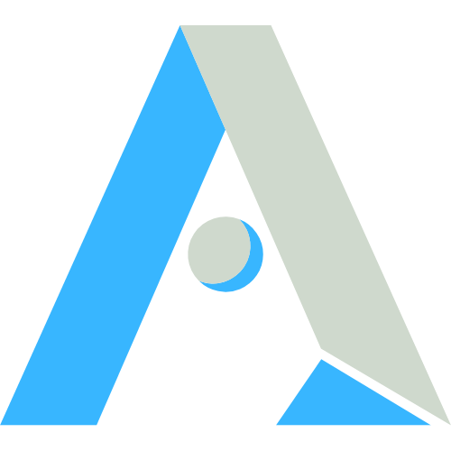

  

<h1 align="center">
  ISnackable Personal Site
</h1>

A personal site created with Next.js as the frontend framework and Sanity.io as the headless content management system.

## Introduction

Although this project was created for my personal website. I tried to make it as easy to setup as possible. This only possible because of using a headless content management system and extensive configuration setup in the project.

However, not everything is seamlessly configurable by editing the `next-web/site.config.ts` file yet. (In-progress)

## Authors

👤 ISnackable

Github: [@ISnackable](https://www.github.com/ISnackable)

## License

Copyright (C) 2021-2022 ISnackable

This project is [GNU GPLv3](https://choosealicense.com/licenses/gpl-3.0/) licensed. Which means you're free to use and modify them so long as you **credit the source**. Copyright and license notices **must be preserved**.

## References

https://github.com/sanity-io/sanity-template-nextjs-event-starter
https://github.com/sanity-io/gatsby-portfolio-preview-poc
