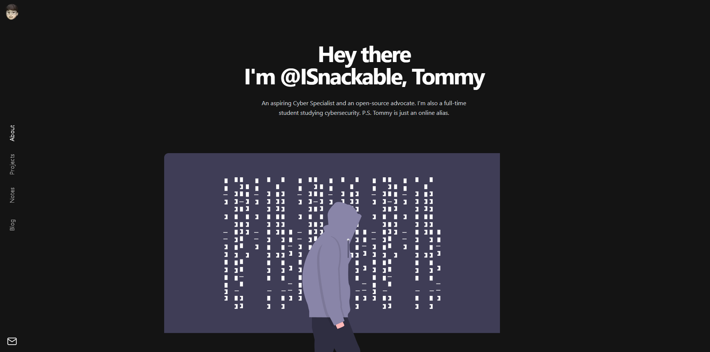

  

<h1 align="center">
  ISnackable Personal Site
</h1>

A personal site created with Gatsby as the frontend framework and Sanity.io as the headless content management system.

## Authors

👤 ISnackable

Github: [@ISnackable](https://www.github.com/ISnackable)

## License

Copyright (C) 2021 ISnackable

This project is [GNU GPLv3](https://choosealicense.com/licenses/gpl-3.0/) licensed.

## References

https://github.com/sanity-io/gatsby-portfolio-preview-poc
