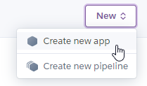

## Introduction

Collaborating on a CTF competition isn't really easy, especially if your team is operating remotely in a different timezone. Managing files and assignment of challenges can get hectic.

My team and I used to collaborate on Discord, and we realised that when we wanted to see the challenges we solved, we would realised that we didn't record down information on how to solve it. Thus, losing the steps on how to solve the challenge.

Looking for a solution, I came across, [CTFNote](https://github.com/TFNS/CTFNote), a collaborative tool aiming to help CTF teams to organise their work. This tool was
developed by [The Flat Network Society](https://github.com/TFNS).

## Hosting it

I decided to host the application on https://www.heroku.com/. My reason for picking Heroku is because it is **free**.

> Heroku is a cloud platform as a service supporting several programming languages. One of the first cloud platforms, Heroku has been in development since June 2007, when it supported only the Ruby programming language, but now supports Java, Node.js, Scala, Clojure, Python, PHP, and Go.
>
> &mdash; <cite>[Wikipedia][1]</cite></p>

## Trying out CTFNote Locally

We can try out the application on our local machine before hosting it on Heroku. Installing it is simple, we can follow the instruction in the CTFNOTE GitHub [README.md](https://github.com/TFNS/CTFNote/tree/graphql#readme) page.

Note: _This is on the graphql branch_

```bash
docker-compose up -d
```

Once we deploy the application, we can visit 127.0.0.1 and create our first account, which will automatically be provided with admin privileges.

According to the docker-compose.yml file, the application consist of 4 services. The backend (api), database (db), frontend (front), & hedgedoc. This will affect how we host it on Heroku later on.

```yaml{4,15,27,36}
# docker-compose.yml
version: "3.7"
services:
  api:
    build:
      context: "./api"
    networks:
      - ctfnote
    environment:
      CREATE_PAD_URL: "http://hedgedoc:3000/new"
      SHOW_PAD_URL: "/"
      DATABASE_URL: "postgres://ctfnote:ctfnote@db:5432/ctfnote"
    depends_on:
      - db
  db:
    build:
      context: "./db"
    restart: always
    environment:
      POSTGRES_PASSWORD: ctfnote
      POSTGRES_USER: ctfnote
      POSTGRES_MULTIPLE_DATABASES: hedgedoc
    volumes:
      - ctfnote-db:/var/lib/postgresql/data
    networks:
      - ctfnote
  front:
    networks:
      - ctfnote
    build:
      context: "./front"
    depends_on:
      - hedgedoc
    ports:
      - 80:80
  hedgedoc:
    image: quay.io/hedgedoc/hedgedoc:1.7.2-debian
    environment:
      - CMD_DB_URL=postgres://ctfnote:ctfnote@db:5432/hedgedoc
      - CMD_URL_PATH=pad
      - CMD_IMAGE_UPLOAD_TYPE=filesystem
    depends_on:
      - db
    restart: always
    volumes:
      - pad-uploads:/home/hackmd/app/public/uploads
    networks:
      - ctfnote
volumes:
  ctfnote-db:
  pad-uploads:
networks:
  ctfnote:
```

## Hosting CTFNote on Heroku

As mentioned, CTFNote consist of 4 different services, this will affect how we host it on Heroku.

As a new user of Heroku, I would later find out that for a Free Tier user, a single "app" would only allow you to use a single web/worker dyno. A dyno is the heart of the Heroku platform and only a web dynos receive can receive HTTP traffics. You can read more about it [here](https://www.heroku.com/dynos).

This would mean that we will need to create 4 Heroku "apps". However, lucky for us, we actually only need to create 3 Heroku "apps" as Hedgedoc has an official installation method on Heroku that combines the Postgres database and the Hedgedoc app together.

Note: _Before you begin, it is assumed that you have created a Heroku account and have setup the Heroku CLI tool. If you have not done that, you should do it before following the steps below._

### Deploy the Hedgedoc app

To deploy the Hedgedoc app, just click on the link and make sure to set the correct config vars as listed below. The CMD\_IMAGE\_UPLOAD\_TYPE & PGSSLMODE config vars can be added later.

Link: https://docs.hedgedoc.org/setup/heroku/

Config Vars

- CMD_DOMAIN=`<your-app-name>.herokuapp.com`
- CMD\_PROTOCOL\_USESSL=`true`
- CMD\_URL\_PATH=`pad`
- CMD\_IMAGE\_UPLOAD_TYPE=`filesystem`
- PGSSLMODE=`no-verify`

Once it has been deployed, open the Heroku Postgres add-on page and copy the Database Credentials URI down somewhere as we will need it later for the backend app.

### Deploy the backend app

Before deploying the backend application to Heroku, you have to change some parts of the code for it to work with Heroku.

```javascript
// api/src/index.ts
...
// Modify app.listen to PORT variable
const PORT = process.env.PORT || 3000;
app.listen(PORT, () => {
	console.log("Listening on :" + PORT);
});

```

1. Create a new app

   

2. Set the config vars

   - CREATE\_PAD\_URL=`https://<your-Hedgedoc-app-name>.herokuapp.com/new`
   - SHOW\_PAD\_URL=`/`
   - DATABASE_URL=`<Database Credentials URI>`
   - PGSSLMODE=`no-verify`

3. Deploy to Heroku using the Heroku CLI

   ```bash
   imagename='ctfnote_api'; appname=<HEROKU_APPNAME>

   docker-compose up --build -d; \
   docker tag $imagename registry.heroku.com/$appname/web; \
   docker push registry.heroku.com/$appname/web; \
   heroku container:release web --app $appname
   ```

### Deploy the frontend app

Before deploying the frontend application to Heroku, you have to change some parts of the code for it to work with Heroku.

```nginx{3-4,18,30}
# front/nginx.conf
server {
    listen $PORT;
    listen [::]:$PORT;

    server_name    localhost;
    server_tokens  off;

    access_log   /logs/access.log;
    error_log   /logs/error.log ;

    location / {
        root   /usr/share/nginx/html;
        index  index.html index.htm;
    }

    location /graphql {
        proxy_pass   http://$HEROKU_APP_BACKEND_URL/graphql;
        proxy_http_version 1.1;
        proxy_set_header Host $http_host;
        proxy_set_header Upgrade $http_upgrade;
        proxy_set_header Connection $http_connection;
        proxy_set_header X-Real-IP $remote_addr;
        proxy_set_header X-Forwarded-For $proxy_add_x_forwarded_for;
        proxy_set_header X-Forwarded-Proto $scheme;
        add_header Pragma "no-cache";
    }

    location /pad/ {
        proxy_pass   http://$HEROKU_APP_PAD_URL/;
        proxy_http_version 1.1;
        proxy_set_header Host $http_host;
        proxy_set_header X-Real-IP $remote_addr;
        proxy_set_header X-Forwarded-For $proxy_add_x_forwarded_for;
        proxy_set_header X-Forwarded-Proto $scheme;
        add_header Pragma "no-cache";
    }
}
```

```docker{24}
# front/Dockerfile
FROM node:latest AS build-deps

RUN mkdir -p /usr/src/app
COPY package.json quasar.conf.js .postcssrc.js yarn.lock babel.config.js quasar.extensions.json /usr/src/app/
RUN cd /usr/src/app && yarn install

COPY src /usr/src/app/src
COPY public /usr/src/app/public

WORKDIR /usr/src/app

RUN yarn build

# _--------_
FROM nginx:alpine

RUN mkdir -p /logs

COPY --from=build-deps /usr/src/app/dist/spa /usr/share/nginx/html

COPY nginx.conf /etc/nginx/conf.d/default.conf

CMD /bin/sh -c "envsubst '\$PORT \$HEROKU_APP_PAD_URL \$HEROKU_APP_BACKEND_URL' < /etc/nginx/conf.d/default.conf > /etc/nginx/conf.d/default.conf" && nginx -g 'daemon off;'
```


1. Create a new app

   

2. Set the config vars

    - HEROKU\_APP\_BACKEND\_URL=`<your-Backend-app-name>.herokuapp.com`
    - HEROKU\_APP\_PAD\_URL=`<your-Hedgedoc-app-name>.herokuapp.com`
    - PGSSLMODE=`no-verify`

3. Deploy to Heroku using the Heroku CLI

   ```bash
   imagename='ctfnote_front'; appname=<HEROKU_APPNAME>

   docker-compose up --build -d; \
   docker tag $imagename registry.heroku.com/$appname/web; \
   docker push registry.heroku.com/$appname/web; \
   heroku container:release web --app $appname
   ```


## Using it

There we go, now that we deployed the application on Heroku, we can visit [https://\<your-Frontend-app-name\>.herokuapp.com]() and create an admin account.

Note: _you might want to quickly register an admin account and turn off registration as soon as possible._


## Acknowledgement

https://github.com/TFNS/CTFNote/

https://stackoverflow.com/questions/52781529/nginx-heroku-docker-is-it-possible-to-run-nginx-as-a-reverse-proxy-on-heroku

[1]: https://en.wikipedia.org/wiki/Heroku
