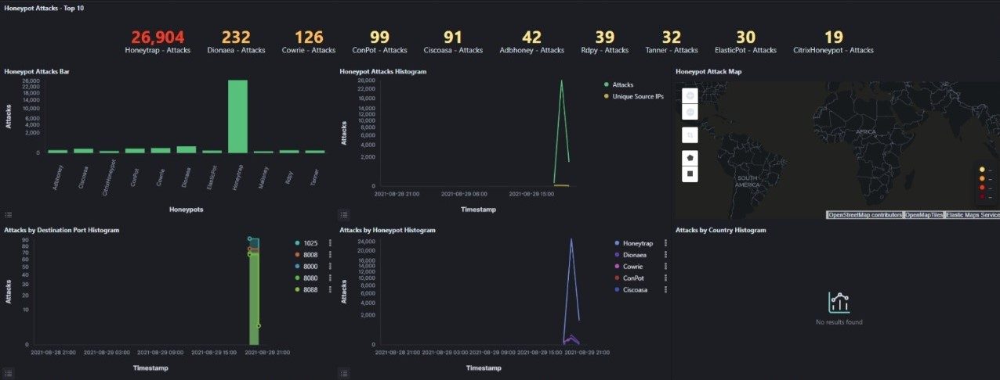
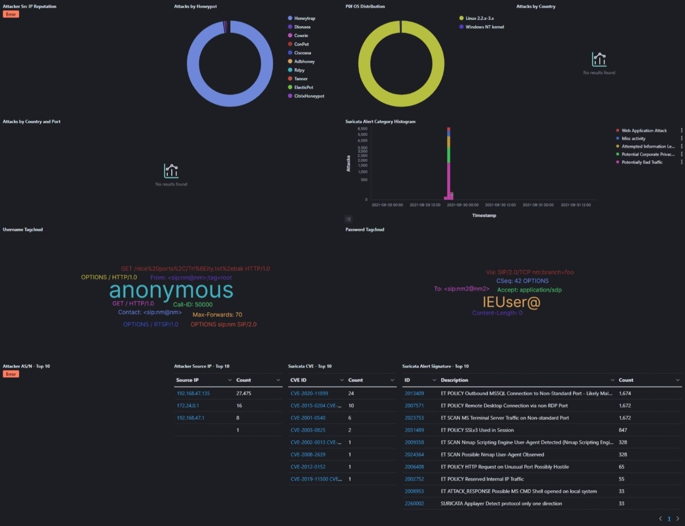
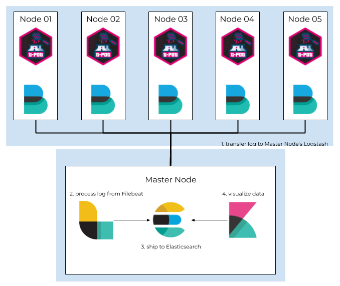

## Introduction

Last week, I was tasked with setting up a honeypot for personal research. While finding out on how to build a honeypot, I came across [T-Pot](https://github.com/telekom-security/tpotce), an open source honeypot platform. T-Pot looks to be an interesting project for a quick deployment of a honeypot. It is designed to run without any interaction or maintenance which seems perfect for me to test.

> A honeypot is a security feature that sets up a simulated trap for attackers to fall into. An attacker can exploit weaknesses on a deliberately compromised computer system, allowing you to analyze them and enhance your security practices.

## T-Pot Technical Concepts

T-Pot is based on the Debian 10 (Buster) network installer. The honeypot daemons as well as other support components are dockered. This allows T-Pot to run multiple honeypot daemons and tools on the same network interface while maintaining a small footprint and constrain each honeypot within its own environment.

The complete list of honeypots in T-Pot:

* [adbhoney](https://github.com/huuck/ADBHoney),
* [ciscoasa](https://github.com/Cymmetria/ciscoasa_honeypot),
* [citrixhoneypot](https://github.com/MalwareTech/CitrixHoneypot),
* [conpot](http://conpot.org/),
* [cowrie](http://www.micheloosterhof.com/cowrie/),
* [ddospot](https://github.com/aelth/ddospot),
* [dicompot](https://github.com/nsmfoo/dicompot),
* [dionaea](https://github.com/DinoTools/dionaea),
* [elasticpot](https://gitlab.com/bontchev/elasticpot),
* [endlessh](https://github.com/skeeto/endlessh),
* [glutton](https://github.com/mushorg/glutton),
* [heralding](https://github.com/johnnykv/heralding),
* [hellpot](https://github.com/yunginnanet/HellPot),
* [honeypy](https://github.com/foospidy/HoneyPy),
* [honeysap](https://github.com/SecureAuthCorp/HoneySAP),
* [honeytrap](https://github.com/armedpot/honeytrap/),
* [ipphoney](https://gitlab.com/bontchev/ipphoney),
* [mailoney](https://github.com/awhitehatter/mailoney),
* [medpot](https://github.com/schmalle/medpot),
* [redishoneypot](https://github.com/cypwnpwnsocute/RedisHoneyPot),
* [rdpy](https://github.com/citronneur/rdpy),
* [snare](http://mushmush.org/),
* [tanner](http://mushmush.org/)

T-Pot may also includes other tools depending on the installation type:

* [Cockpit](https://cockpit-project.org/running) for a lightweight, webui for docker, os, real-time performance monitoring and web terminal.
* [Cyberchef](https://gchq.github.io/CyberChef/) a web app for encryption, encoding, compression and data analysis.
* [ELK stack](https://www.elastic.co/videos) to beautifully visualize all the events captured by T-Pot.
* [Elasticsearch Head](https://mobz.github.io/elasticsearch-head/) a web front end for browsing and interacting with an Elastic Search cluster.
* [Fatt](https://github.com/0x4D31/fatt) a pyshark based script for extracting network metadata and fingerprints from pcap files and live network traffic.
* [Spiderfoot](https://github.com/smicallef/spiderfoot) a open source intelligence automation tool.
* [Suricata](http://suricata-ids.org/) a Network Security Monitoring engine.

The figure below shows the architecture of the T-Pot system


## Trying it out locally

T-Pot has a system requirement of:

- 8 GB RAM (less RAM is possible but might introduce swapping / instabilities)
- 128 GB SSD (smaller is possible but limits the capacity of storing events)
- Network via DHCP
- A working, non-proxied, internet connection

To start testing it, I made use of the provided ISO image in the GitHub [releases](https://github.com/telekom-security/tpotce/releases/tag/20.06.2) and booted it up in a virtual machine (VM). The installation process was extremely simple, it took me about 5-10 minutes to get a fully functionally honeypot up and running from nothing.

To view and analyze the events/logs of the Honeypots, there is an Elasticsearch, Logstash, Kibana (ELK) dashboard to learn about the cyberattacks on the Honeypot system. Running a nmap scan on the Honeypot produce a result shown in the figures below.

Elasticsearch Dashboard:





## Distributed System

T-Pot does not have any remote logging which did not make sense to me, it stores all of the events that was captured in the honeypot itself. Wouldn't that mean that if an attacker has successfully compromised the honeypot, they could delete the logs?. Of course they will have to escape the docker container too, but a hacker is skilled enough, it is entirely possible. However, since I am not an expert in this matter, I do not know if this is truly the case. Nevertheless, I would still like to setup a distributed system for remote logging.

There is a GitHub discussion [#250](https://github.com/telekom-security/tpotce/discussions/250) regarding on a distributed installation type. Which discuss about the advantages and possible issues on a distributed installation. It also gives some hints on how to setup a distributed system. One example would be [derp7331/tpot_distributed](https://github.com/derp7331/tpot_distributed), derp7331 has developed scripts to setup a distributed T-Pot (18.11) infrastructure, which is a good starting point. The author of T-Pot mentioned that distributed installation is not a priority, and will be on the to-do list. 

Setting up a distributed T-Pot system requires manual tweaking of the docker-compose file. or utilizing derp7331's scripts to tweak the configuration files. However, derp7331 scripts is outdated and would not work on the latest version of T-Pot. Thus, we will have to look into the first method. Luckily for me, someone has already done that for us: [Theo Chen Blog](https://blog.theo.com.tw/Research/Deploy-A-Distributed-T-Pot-System-For-Personal-Research-In-Budget-Part-2/).

The distributed system will make use of [Filebeat](https://www.elastic.co/beats/filebeat), a lightweight shipper for forwarding and centralizing log data. The system architecture of a distributed system can be seen in the figure below.



For Filebeat to send the raw log data to the central logging server, it requires a filebeat.yml config for T-Pot, you can refer to my forked T-Pot repository at [here](https://github.com/ISnackable/tpotce). Logstash will listen to the request from Filebeat from 64299/tcp.

Guide:

1. Install the Debain 10 (Stable) [ISO](https://www.debian.org/releases/buster/debian-installer/)
2. Clone this repository 
3. Follow the commands below

On both server:

```bash
$ apt install nodejs npm git vim ethtool python3-venv python3-pip glances htop docker-compose curl cockpit cockpit-docker
$ curl -sSL https://get.docker.com/ | sh
$ usermod -aG docker root
```

On central collector server:

```bash
$ git clone https://github.com/ISnackable/tpotce
$ cp tpotce/docker/elk/logstash/dist/logstash_with_filebeat.conf /opt/logstash.conf

# Follow the official instruction to install as "COLLECTOR" type
$ cd tpotce/iso/installer/
$ ./install.sh --type=user
```

On each sensor server:

```bash
$ git clone https://github.com/ISnackable/tpotce
$ cp tpotce/docker/elk/filebeat/fi* /opt/

# Follow the official instruction to install as "NEXTGEN" type
$ vim /opt/filebeat.yml # Modify your central collector server's IP
$ cd tpotce/iso/installer/
$ ./install.sh --type=user
```

## Hosting on AWS

Hosting it on AWS is pretty simple, make sure to properly configure the Security groups and just follow the guide written by @mkmety. You may want to setup encrpytion for remote logging using SSL, or setup a Wireguard VPN to communication between the central logging server and honeypot sensors.

https://medium.com/@mkmety/deploying-t-pot-the-all-in-one-honeypot-platform-on-aws-ec2-33f019c645fb

## Resources

Speical thanks to Theo Chen and all of the resources I found below.

- https://github.com/telekom-security/tpotce
- https://github.com/derp7331/tpot_distributed
- https://blog.theo.com.tw/Research/Deploy-A-Distributed-T-Pot-System-For-Personal-Research-In-Budget-Part-2/
- https://medium.com/@mkmety/deploying-t-pot-the-all-in-one-honeypot-platform-on-aws-ec2-33f019c645fb